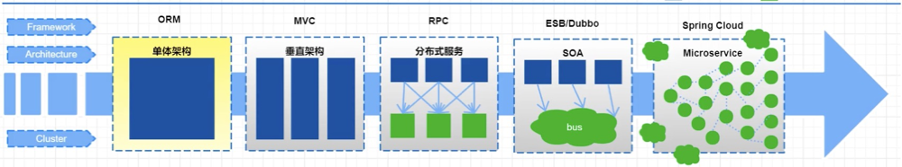

# 微服务
## 什么是微服务？
>微服务是由以单一应用程序构成的，自己拥有自己的进程与轻量化处理，服务依业务功能设计，以全自动的方式部署，与其他服务使用 HTTP API 通信。同时服务会使用最小的规模的集中管理能力，服务可以用不同的编程语言与数据库等组件实现。

## 架构是如何演变的？

### 单体应用架构：
把所有功能都集中在一个应用中，统一部署，开发成本、部署成本和维护成本低
- 优点：项目架构简单，适合用户量少的项目，开发成本低，项目部署在一个节点上，维护方便。
- 缺点：功能集中在一个工程中，对于大型项目比一开发和维护，项目模块紧耦合，单点容错率低，无法对不同的模块功能进行针对性的优化和水平拓展
### 垂直应用架构：
所谓垂直应用架构，其实就是把之前的单体应用拆分成多个应用，以提升效率，比如电商系统可以拆分成：电商系统、后台系统、CMS系统
- 优点：项目拆分实现了流量分担，解决了并发问题，而且可以针对不同模块进行优化和水平拓展，同时不同的系统之间不会互相影响，提高容错率
- 缺点：系统之间互相存在，无法进行相互调用，系统之间互相独立，会造成一部分功能的冗余
### 分布式架构：
随着业务的增加，在垂直应用架构中冗余的业务代码越来越多，就需要将冗余的部分抽取出来，统一做成业务层单独处理，变成一个单独的服务，控制层调用不同的业务层服务就能完成不同的业务功能，具体表现就是一个项目拆分成表现层和服务层两个部分，服务层中包含业务逻辑，表现层只需要处理和页面的交互，业务逻辑都是调用服务层的服务来实现，这就是分布式架构。
- 优点：抽取公共的功能作为服务层，提高代码复用行。
- 缺点：系统间耦合度变高，调用关系错综复杂，难以维护。
### SOA架构：
分布式架构中的缺点就是调用复杂，而且当服务越来越多，或者当某一个服务压力过大需要水平拓展和负载均衡，对于资源调度和治理就需要用到治理中心SOA（Service Oriented Architecture）为核心来解决，同时治理中心还可以帮助我们解决服务之间协议不同的问题。
- 优点：使用治理中心（ESB\dubbo）解决了服务见调用关系的自动调节
- 缺点：服务间会有依赖关系，一旦某个环节出错会影响较大（服务雪崩），服务关系复杂，运维、测试部署困难。
### 微服务架构：
- 微服务架构在某种程度上面架构SOA继续发展的下一步，它更加强调服务的“彻底拆分”，目的就是提高效率，微服务架构中，每个服务必须独立部署同时互不影响，微服务架构更加轻巧，轻量级。
- 微服务架构与SOA架构的不同
- 微服务架构比SOA架构会更加的精细，让专业的人去做专业的。
- 目的是提高效率每个服务之间互不影响，微服务架构中，每个服务需要独立部署
- SOA架构中可能数据库存储会发生共享，微服务强调每个服务都是单独数据库，保证每个服务之间互不影响。
- 微服务项目架构比SOA架构更加适合与互联网公司迅捷开发、快速迭代版本，因为粒度非常精细。

# nacos

#