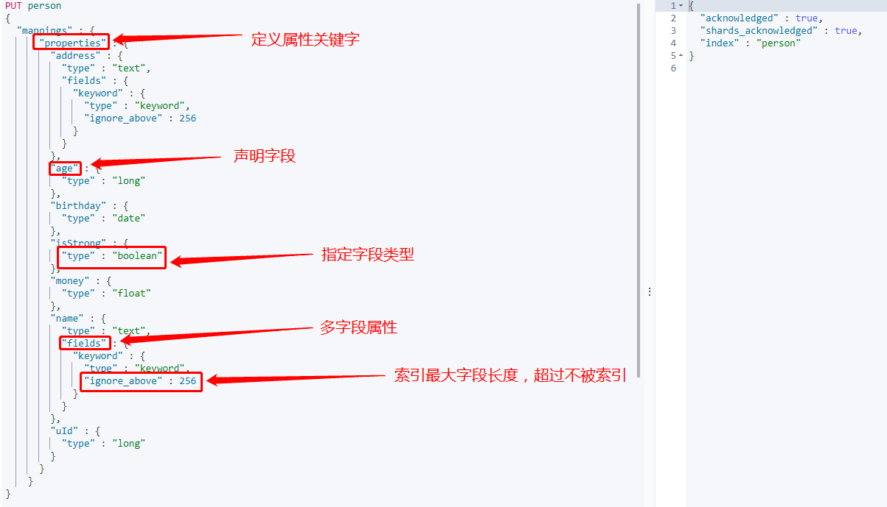

[Mapping官网](https://www.elastic.co/guide/en/elasticsearch/reference/current/mapping-types.html)
#### 查询映射 GET [/[index]/_mapping](127.0.0.1:9200/[index]/_mapping)
```json
{   
  //索引名
    "contact":{
      //映射
        "mappings":{
          //属相
            "properties":{
                "_class":{
                  //text 为映射类型
                    "type":"text",
                    "fields":{
                        "keyword":{
                            "type":"keyword",
                            "ignore_above":256
                        }
                    }
                },
                "brandName":{
                    "type":"text",
                    "fields":{
                        "keyword":{
                            "type":"keyword",
                            "ignore_above":256
                        }
                    }
                },
                "id":{
                    "type":"long"
                },
                "itemName":{
                    "type":"text",
                    "fields":{
                        "keyword":{
                            "type":"keyword",
                            "ignore_above":256
                        }
                    }
                },
                "picUrl":{
                    "type":"text",
                    "fields":{
                        "keyword":{
                            "type":"keyword",
                            "ignore_above":256
                        }
                    }
                },
                "subName":{
                    "type":"text",
                    "fields":{
                        "keyword":{
                            "type":"keyword",
                            "ignore_above":256
                        }
                    }
                }
            }
        }
    }
}
```
keyword: 无法被分词 `"ignore_above":256` 超过256后，会自动截取前256字符串，用于排序，聚合，对比等
text：用于倒排搜索
​	**①** **常见类型**

​		**1)** **数字类型**：

​				long	integer	short	byte	double	float	half_float	scaled_float   unsigned_long

​		**2)** **Keywords**：

​				**keyword**：适用于索引结构化的字段，可以用于过滤、排序、聚合。keyword类型的字段只能通过精确值（exact value）搜索到。Id应该用keyword

​				constant_keyword：始终包含相同值的关键字字段

​				wildcard：可针对类似grep的[通配符查询](https://www.elastic.co/guide/en/elasticsearch/reference/7.10/query-dsl-wildcard-query.html)优化日志行和类似的关键字值

​				关键字字段通常用于[排序](https://www.elastic.co/guide/en/elasticsearch/reference/7.10/sort-search-results.html)， [汇总](https://www.elastic.co/guide/en/elasticsearch/reference/7.10/search-aggregations.html)和[Term查询](https://www.elastic.co/guide/en/elasticsearch/reference/7.10/term-level-queries.html)，例如[`term`](https://www.elastic.co/guide/en/elasticsearch/reference/7.10/query-dsl-term-query.html)。

​		**3)** **Dates**（时间类型）：包括[`date`](https://www.elastic.co/guide/en/elasticsearch/reference/7.10/date.html)和 [`date_nanos`](https://www.elastic.co/guide/en/elasticsearch/reference/7.10/date_nanos.html)

​		4) **alias**：为现有字段定义别名。

​		5) [binary](https://www.elastic.co/guide/en/elasticsearch/reference/current/binary.html)（二进制）：[binary](https://www.elastic.co/guide/en/elasticsearch/reference/current/binary.html)

​		6) [range](https://www.elastic.co/guide/en/elasticsearch/reference/current/range.html)（区间类型）：integer_range、float_range、long_range、double_range、date_range

​		7) **text：当一个字段是要被全文搜索的，比如Email内容、产品描述，这些字段应该使用text类型。设置text类型以后，字段内容会被分析，在生成倒排索		引以前，字符串会被分析器分成一个一个词项。text类型的字段不用于排序，很少用于聚合。（解释一下为啥不会为text创建正排索引：大量堆空间，尤其是		在加载高基数text字段时。字段数据一旦加载到堆中，就在该段的生命周期内保持在那里。同样，加载字段数据是一个昂贵的过程，可能导致用户遇到延迟问		题。这就是默认情况下禁用字段数据的原因）**

​	**② 对象关系类型：**

​		**1) object：用于单个JSON对象**

​		**2) nested：用于JSON对象数组**

​		3) [flattened](https://www.elastic.co/guide/en/elasticsearch/reference/current/flattened.html)：允许将整个JSON对象索引为单个字段。

​	**③ 结构化类型：**

​		**1) geo-point：纬度/经度积分**

​		**2) geo-shape：用于多边形等复杂形状**

​		**3) point：笛卡尔坐标点**

​		**2) shape：笛卡尔任意几何图形**

​	④ 特殊类型：

​		**1) IP地址：ip 用于IPv4和IPv6地址**

​		**2) [completion](#completion-suggester)：提供自动完成建议**

​		3) tocken_count：计算字符串中令牌的数量

​		4) [murmur3](https://www.elastic.co/guide/en/elasticsearch/plugins/7.7/mapper-murmur3.html)：在索引时计算值的哈希并将其存储在索引中

​		5) [annotated-text](https://www.elastic.co/guide/en/elasticsearch/plugins/7.7/mapper-annotated-text.html)：索引包含特殊标记的文本（通常用于标识命名实体）

​		6) [percolator](https://www.elastic.co/guide/en/elasticsearch/reference/current/percolator.html)：接受来自query-dsl的查询

​		7) join：为同一索引内的文档定义父/子关系

​		8) [rank features](https://www.elastic.co/guide/en/elasticsearch/reference/current/rank-features.html)：记录数字功能以提高查询时的点击率。

​		9) [dense vector](https://www.elastic.co/guide/en/elasticsearch/reference/current/dense-vector.html)：记录浮点值的密集向量。

​		10) [sparse vector](https://www.elastic.co/guide/en/elasticsearch/reference/current/sparse-vector.html)：记录浮点值的稀疏向量。

​		11) [search-as-you-type](https://www.elastic.co/guide/en/elasticsearch/reference/current/search-as-you-type.html)：针对查询优化的文本字段，以实现按需输入的完成

​		12) [histogram](https://www.elastic.co/guide/en/elasticsearch/reference/current/histogram.html)：histogram 用于百分位数聚合的预聚合数值。

​		13) [constant keyword](https://www.elastic.co/guide/en/elasticsearch/reference/current/constant-keyword.html)：keyword当所有文档都具有相同值时的情况的 专业化。

​	⑤ array（数组）：在Elasticsearch中，数组不需要专用的字段数据类型。默认情况下，任何字段都可以包含零个或多个值，但是，数组中的所有值都必须具有		相同的数据类型。

​	⑥新增：

​		1) date_nanos：date plus 纳秒

​		2) features：

####	两种映射类型

- ##### Dynamic field mapping：

    - ##### 整数				     =>	long

    - ##### 浮点数			     =>	float

    - ##### true || false	 =>	boolean

    - ##### 日期		             =>	date

    - ##### 数组                     =>    取决于数组中的第一个有效值

    - ##### 对象                     =>    object

    - ##### 字符串                 =>    如果不是数字和日期类型，那会被映射为text和keyword两个类型

      除了上述字段类型之外，其他类型都必须显示映射，也就是必须手工指定，因为其他类型ES无法自动识别。

- #### Expllcit field mapping：手动映射

##### PUT /[index]
```json
{
  "properties":{
    "title":{
      "type":"text",
      "analyzer":"ik_max_word",
      "search_analyzer":"ik_smart"
    },
    "content":{
      "type":"text",
      "analyzer":"ik_max_word",
      "search_analyzer":"ik_smart"
    },
    "types":{
      "type":"keyword"
    },
    "read":{
      "type":"integer"
    }
  }
}
```

#### 映射参数

​	**①** **index：是否对创建对当前字段创建倒排索引，默认true，如果不创建索引，该字段不会通过索引被搜索到,但是仍然会在source元数据中展示**

​	② **analyzer：指定分析器（character filter、tokenizer、Token filters）。**

​	③ boost：对当前字段相关度的评分权重，默认1

##### ④ coerce：是否允许强制类型转换  true “1”=> 1  false “1”=< 1
coerce：
不设置  默认支持强制转换  integer类型传入 `123`不会报错
"coerce": false 关闭支持强制转换  integer类型传入 `123`会报错
##### （coerce私有字段设置）PUT /[index]

```json
{
  "mappings": {
    "properties": {
      "number_one": {
        "type": "integer"
      },
      "number_two": {
        "type": "integer",
        //私有字符设置  不支持强制转换
        "coerce": false
      }
    }
  }
}
```

##### （coerce全局字段设置）PUT /[index]

```json
{ 
  "settings": {
    //全局设置不支持强制转换
    "index.mapping.coerce": false
  },
  "mappings": {
    "properties": {
      "number_one": {
        "type": "integer"
      },
      "number_two": {
        "type": "integer"
      }
    }
  }
}
```

​	⑤ copy_to：该参数允许将多个字段的值复制到组字段中，然后可以将其作为单个字段进行查询

​	**⑥** **doc_values：为了提升排序和聚合效率，默认true，如果确定不需要对字段进行排序或聚合，也不需要通过脚本访问字段值，则可以禁用doc值以节省磁盘		空间（不支持text和annotated_text）**

​	⑦ dynamic：控制是否可以动态添加新字段

​		1) true 新检测到的字段将添加到映射中。（默认）

​		2) false 新检测到的字段将被忽略。这些字段将不会被索引，因此将无法搜索，但仍会出现在_source返回的匹配项中。这些字段不会添加到映射中，必须显式			添加新字段。

​		3) strict 如果检测到新字段，则会引发异常并拒绝文档。必须将新字段显式添加到映射中

​	**⑧** **eager_global_ordinals：用于聚合的字段上，优化聚合性能。**

​		1) Frozen indices（冻结索引）：有些索引使用率很高，会被保存在内存中，有些使用率特别低，宁愿在使用的时候重新创建，在使用完毕后丢弃数据，			Frozen indices的数据命中频率小，不适用于高搜索负载，数据不会被保存在内存中，堆空间占用比普通索引少得多，Frozen indices是只读的，请求可能			是秒级或者分钟级。***\*eager_global_ordinals不适用于Frozen indices\****

​	⑨ **enable：是否创建倒排索引，可以对字段操作，也可以对索引操作，如果不创建索引，让然可以检索并在_source元数据中展示，谨慎使用，该状态无法		修改。**

```
    PUT my_index
    {
      "mappings": {
        "enabled": false
      }
    }
```

​	**⑩** **fielddata：查询时内存数据结构，在首次用当前字段聚合、排序或者在脚本中使用时，需要字段为fielddata数据结构，并且创建倒排索引保存到堆中**

​	**⑪** **fields：给field创建多字段，用于不同目的（全文检索或者聚合分析排序）**

​	⑫ format：格式化

```
  "date": {
     "type":  "date",
     "format": "yyyy-MM-dd"
   }
```

​	⑬ ignore_above：超过长度将被忽略

​	⑭ ignore_malformed：忽略类型错误

​	⑮ index_options：控制将哪些信息添加到反向索引中以进行搜索和突出显示。仅用于text字段

​	⑯ Index_phrases：提升exact_value查询速度，但是要消耗更多磁盘空间

​	⑰ Index_prefixes：前缀搜索

​		1) min_chars：前缀最小长度，>0，默认2（包含）

​		2) max_chars：前缀最大长度，<20，默认5（包含）

​	⑱ meta：附加元数据

​	⑲ normalizer：

​	**⑳ norms：是否禁用评分（在filter和聚合字段上应该禁用）。**

​	**21 null_value：为null值设置默认值**

​	22 position_increment_gap：

​	23 proterties：除了mapping还可用于object的属性设置

​	**24 search_analyzer：设置单独的查询时分析器：**

​	25 similarity：为字段设置相关度算法，支持BM25、claassic（TF-IDF）、boolean

​	**26 store：设置字段是否仅查询**

​	**27 term_vector：**运维参数