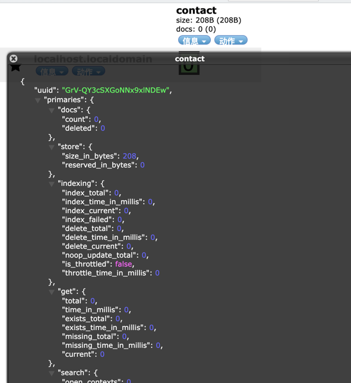
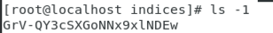
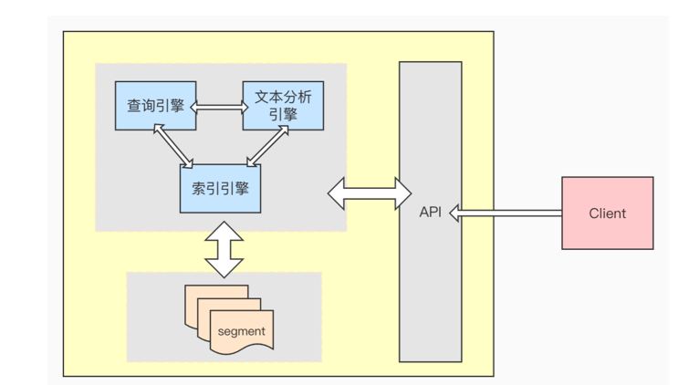
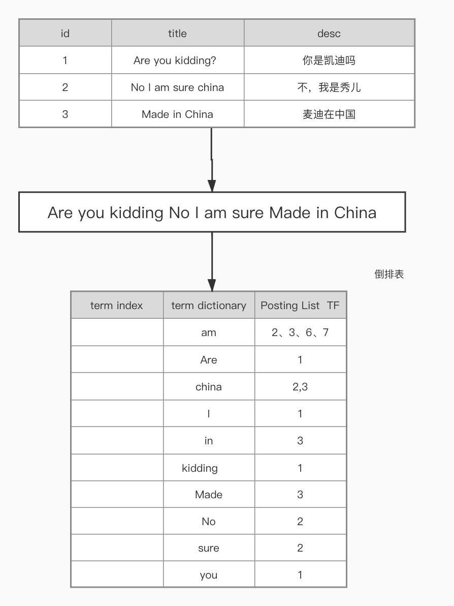

# ES
## 版本选择
|  Spring Data  Release Train | Spring Data Elasticsearch  | Elasticsearch  | Spring Framework  | Spring Boot |
|  ----  | ----  |  ----  |  ----  |  ----  |
| 2021.0 (Pascal)  | 4.2.1 | 7.12.1 | 5.3.7 | 2.5.x |
| 2020.0 (Ockham)  | 4.1.x | 7.9.3 | 5.3.2 | 2.4.x | 
| Neumann  | 4.0.x | 7.6.2 | 5.2.12 | 2.3.x |
| Moore  | 3.2.x | 6.8.12 | 5.2.12 | 2.2.x |
| Lovelace[1]  | 3.1.x[1] | 6.2.2 | 5.1.19 | 2.1.x |
| Kay[1]  | 3.0.x[1] | 5.5.0 | 5.0.13 | 2.0.x |
| Ingalls[1]  | 2.1.x[1] | 2.4.0 | 4.3.25 | 1.5.x |


表格仅供参考，来自https://docs.spring.io/spring-data/elasticsearch/docs/4.2.4/reference/html/#preface.metadata
## 集群的健康检查
### 健康状态
| 颜色 | 状态 | 描述 |
| ---- | ---- | ---- |
| 绿色 | Green | 所有Primary和Replica均为active，集群状态健康 |
| 黄色 | Yellow | 至少一个Replica不可用，但是所有Primary均为active，数据仍然是可以保证完整性的  |
| 红色 | Red | 至少一个Primary为不可用状态，数据不完整，集群不可用 |
### 健康值查询
#### [_cat/health](127.0.0.1:9200/_cat/health)
```json
1633439110 13:05:10 docker-cluster green 1 1 1 1 0 0 0 0 - 100.0%
```
#### [_cat/health?v](http://cc:9200/_cat/health?v)
```json
epoch      timestamp cluster        status node.total node.data shards pri relo init unassign pending_tasks max_task_wait_time active_shards_percent
1633439147 13:05:47  docker-cluster green           1         1      1   1    0    0        0             0                  -                100.0%
```
```java
epoch // 1970年1月1日 到现在的毫秒数(换算北京时间需要+8小时)
timestamp //当前时间  (换算北京时间需要+8小时)
cluster//集群名称
status//集群当前的健康状态
node.total//当前包含的所有节点数
node.data//当前存放数据的节点
shards//当前分片数量
pri//主副本数量
relo//迁移中的分片数量
init//初始化中的分片数量
unassign//未分配的分片数量
pending_tasks//当前任务数量
max_task_wait_time//最大的任务等待时间
active_shards_percent//当前活动分片的百分比（当前工作分片的百分比）
```
#### [_cluster/health](127.0.0.1:9200/_cluster/health)
```json
{
  "cluster_name":"docker-cluster",
  "status":"green",
  "timed_out":false,
  "number_of_nodes":1,
  "number_of_data_nodes":1,
  "active_primary_shards":1,
  "active_shards":1,
  "relocating_shards":0,
  "initializing_shards":0,
  "unassigned_shards":0,
  "delayed_unassigned_shards":0,
  "number_of_pending_tasks":0,
  "number_of_in_flight_fetch":0,
  "task_max_waiting_in_queue_millis":0,
  "active_shards_percent_as_number":100
}
```
### 分片与副本
- index对应多个数据分片（分片组合等于完整数据）
- 数据分片对应多个数据副本（副本等于数据数据的复制）
- 所有副本数据均为active，active相同数据有一个Primary(主副本)与多个Replica(副本)
## Elasticsearch核心概念
### 概念
#### 全文搜索引擎
```text
自然语言处理、百度、谷歌、爬虫、大数据处理
```
#### 垂直搜索引擎（垂直领域,有目的有范围的搜索）
```text
电商平台、OA、某领域
```
#### 搜索引擎的要求？
##### 查询速度快（返回速度）
###### 高效的压缩算法
###### 快速的编码和解码速度
##### 结果准度（准却度）
###### BM25
###### TF-IDF
##### 检索结果丰富（广度、召回率）
### Elasticsearch存储
从图片里看到uuid

进入docker 中的 ES
```bash
docker exec -ti elasticsearch  /bin/bash
```
进入数据存放目录
```bash
cd data/nodes/0/indices/
```
输入 `ls -1`可以看到如下图片内容对应uuid


进入对应`uuid`目录后
```bash 
cd 0/index
```
### Lucene全文检索流畅图（ES的底层是Lucene）

### 倒排索引图

到达对应index 数据存储目录
## 应用
### 倒排
### 索引
### Mapping
### 分词器
#### ik分词器（中文）
https://github.com/medcl/elasticsearch-analysis-ik

#### 文档正常化: normalization
#### 字符过滤器: character filter
#### 令牌过滤器: token filter
#### 分词器: tokenizer
#### 自定义分词器
#### 中文分词器
#### 基于远程词库的热更新
#### 基于MySQL的热更新
### 聚合
### Elasticsearch 客户端 & Java API
#### 简单介绍
- 与语言无关 支持的语言API https://www.elastic.co/guide/en/elasticsearch/client/index.html
- 官网 JavaAPI弃用 8.0版本会被删除 https://www.elastic.co/guide/en/elasticsearch/client/java-api/current/java-api.html
- 推荐使用Java REST https://www.elastic.co/guide/en/elasticsearch/client/java-rest/current/index.html
#### 注意事项
- `TransportClient` 使用`transport`模块（**9300端口**）远程连接到 Elasticsearch 集群，客户端并不加入集群，而是通过获取单个或者多个transport地址来以轮询的方式与他们通信。
- `TransportClient`使用`transport`协议与Elasticsearch节点通信，如果客户端的版本和与其通信的ES实例的版本不同，就会出现兼容性问题。而`low-level REST`使用的是HTTP协议，可以与任意版本ES集群通信。`high-level REST`是基于`low-level REST`的。
#### Maven依赖
```xml
<dependency>
    <groupId>org.elasticsearch.client</groupId>
    <artifactId>transport</artifactId>
    <version>7.12.1</version>
</dependency>
```
#### [文档地址https://www.elastic.co/guide/en/elasticsearch/reference/current/documents-indices.html?baymax=rec&rogue=rec-1&elektra=guide](https://www.elastic.co/guide/en/elasticsearch/reference/current/documents-indices.html?baymax=rec&rogue=rec-1&elektra=guide)
### [Spring Data Elasticsearch](https://docs.spring.io/spring-data/elasticsearch/docs/4.2.4/reference/html/#preface)

#### 官网

https://spring.io/projects/spring-data-elasticsearch

#### 兼容性(必看)

https://docs.spring.io/spring-data/elasticsearch/docs/4.2.1/reference/html/#preface.requirements

#### 文档地址

https://docs.spring.io/spring-data/elasticsearch/docs/4.2.1/reference/html/#reference

#### 优缺点

- 优点：用统一的接口，适配所有不同的存储类型，学习成本低。
- 缺点：适配的版本要比原生的 API 要慢。这个取决于 Spring Data Elasticsearch 团队的开发速度。无法使用ES的一些新特性

#### 注解

```java
@Document：在类级别应用，以指示该类是映射到数据库的候选类。最重要的属性包括：

indexName：用于存储此实体的索引的名称。它可以包含类似于“日志-#{T（java.time.LocalDate）.now（）.toString（）}”

type :映射类型。如果未设置，则使用该类的小写简单名称。（自4.0版起已弃用）

createIndex：标记是否在存储库引导时创建索引。默认值为true。请参阅自动创建带有相应映射的索引

versionType：版本管理的配置。默认值为外部 .

@Id：在字段级别应用，以标记用于标识的字段。

@Transient：默认情况下，存储或检索文档时，所有字段都映射到文档，此批注不包括该字段。

@PersistenceConstructor：标记在从数据库实例化对象时要使用的给定构造函数（甚至是包受保护的构造函数）。构造函数参数按名称映射到检索文档中的键值。

@Field：应用于字段级别并定义字段的属性，大多数属性映射到相应的Elasticsearch映射定义（以下列表不完整，请查看注释Javadoc以获取完整的参考）：

name：将在Elasticsearch文档中表示的字段的名称，如果未设置，则使用Java字段名称。

type：字段类型，可以是Text，关键字，Long，Integer，Short，Byte，Double，Float，Half_Float，Scaled_Float，日期，日期Nanos，Boolean，Binary，Integer_Range，Float_Range，Long_Range，DoubleˉRange，DateˉRange，Object，Nested，Ip，TokenCount，percollator，flatten，搜索。请参阅Elasticsearch映射类型

format：一个或多个内置日期格式，请参阅下一节格式数据映射 .

pattern：一个或多个自定义日期格式，请参阅下一节格式数据映射 .

store：标志是否应将原始字段值存储在Elasticsearch中，默认值为假 .

analyzer ,搜索分析器 ,normalizer用于指定自定义分析器和规格化器。

@GeoPoint：将字段标记为地理点如果字段是GeoPoint班级
```

#### 操作类型

Spring Data Elasticsearch 使用多个接口来定义可以针对 Elasticsearch 索引调用的操作。

- `IndexOperations`定义索引级别的操作，例如创建或删除索引。
- `DocumentOperations`定义基于 id 存储、更新和检索实体的操作。
- `SearchOperations`定义使用查询搜索多个实体的操作
- `ElasticsearchOperations`结合了`DocumentOperations`和`SearchOperations`接口。