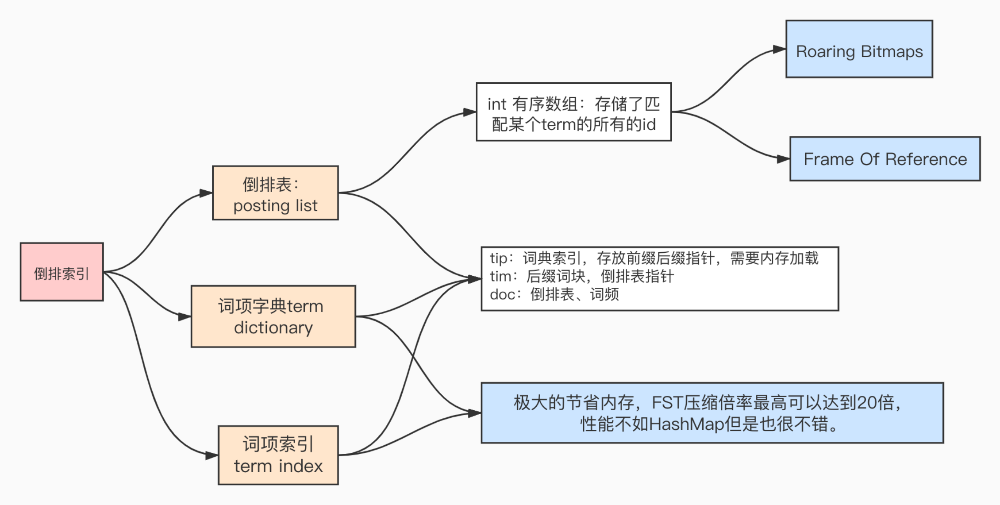
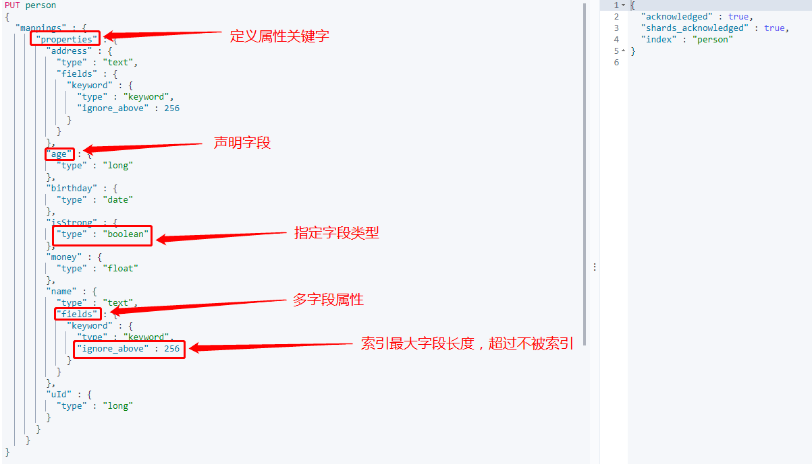

# ES
## 版本选择
|  Spring Data  Release Train | Spring Data Elasticsearch  | Elasticsearch  | Spring Framework  | Spring Boot |
|  ----  | ----  |  ----  |  ----  |  ----  |
| 2021.0 (Pascal)  | 4.2.1 | 7.12.1 | 5.3.7 | 2.5.x |
| 2020.0 (Ockham)  | 4.1.x | 7.9.3 | 5.3.2 | 2.4.x | 
| Neumann  | 4.0.x | 7.6.2 | 5.2.12 | 2.3.x |
| Moore  | 3.2.x | 6.8.12 | 5.2.12 | 2.2.x |
| Lovelace[1]  | 3.1.x[1] | 6.2.2 | 5.1.19 | 2.1.x |
| Kay[1]  | 3.0.x[1] | 5.5.0 | 5.0.13 | 2.0.x |
| Ingalls[1]  | 2.1.x[1] | 2.4.0 | 4.3.25 | 1.5.x |


表格仅供参考，来自https://docs.spring.io/spring-data/elasticsearch/docs/4.2.4/reference/html/#preface.metadata
## 集群的健康检查
### 健康状态
| 颜色 | 状态 | 描述 |
| ---- | ---- | ---- |
| 绿色 | Green | 所有Primary和Replica均为active，集群状态健康 |
| 黄色 | Yellow | 至少一个Replica不可用，但是所有Primary均为active，数据仍然是可以保证完整性的  |
| 红色 | Red | 至少一个Primary为不可用状态，数据不完整，集群不可用 |
### 健康值查询
#### GET [_cat/health](127.0.0.1:9200/_cat/health)
```json
1633439110 13:05:10 docker-cluster green 1 1 1 1 0 0 0 0 - 100.0%
```
#### GET [_cat/health?v](http://cc:9200/_cat/health?v)
```json
epoch      timestamp cluster        status node.total node.data shards pri relo init unassign pending_tasks max_task_wait_time active_shards_percent
1633439147 13:05:47  docker-cluster green           1         1      1   1    0    0        0             0                  -                100.0%
```
```java
epoch // 1970年1月1日 到现在的毫秒数(换算北京时间需要+8小时)
timestamp //当前时间  (换算北京时间需要+8小时)
cluster//集群名称
status//集群当前的健康状态
node.total//当前包含的所有节点数
node.data//当前存放数据的节点
shards//当前分片数量
pri//主副本数量
relo//迁移中的分片数量
init//初始化中的分片数量
unassign//未分配的分片数量
pending_tasks//当前任务数量
max_task_wait_time//最大的任务等待时间
active_shards_percent//当前活动分片的百分比（当前工作分片的百分比）
```
#### GET [_cluster/health](127.0.0.1:9200/_cluster/health)
```json
{
  "cluster_name":"docker-cluster",
  "status":"green",
  "timed_out":false,
  "number_of_nodes":1,
  "number_of_data_nodes":1,
  "active_primary_shards":1,
  "active_shards":1,
  "relocating_shards":0,
  "initializing_shards":0,
  "unassigned_shards":0,
  "delayed_unassigned_shards":0,
  "number_of_pending_tasks":0,
  "number_of_in_flight_fetch":0,
  "task_max_waiting_in_queue_millis":0,
  "active_shards_percent_as_number":100
}
```
### 分片与副本
- index对应多个数据分片（分片组合等于完整数据）
- 数据分片对应多个数据副本（副本等于数据数据的复制）
- 所有副本数据均为active，active相同数据有一个Primary(主副本)与多个Replica(副本)
## Elasticsearch核心概念
### 全文搜索引擎
```text
自然语言处理、百度、谷歌、爬虫、大数据处理
```
### 垂直搜索引擎（垂直领域,有目的有范围的搜索）
```text
电商平台、OA、某领域
```
### 搜索引擎的要求？
#### 查询速度快（返回速度）
##### 高效的压缩算法
###### FOR压缩算法
##### 快速的编码和解码速度
#### 结果准度（准却度）
##### BM25
##### TF-IDF
#### 检索结果丰富（广度、召回率）
### 倒排数据结构图

### Elasticsearch存储
从图片里看到uuid

进入docker 中的 ES
```bash
docker exec -ti elasticsearch  /bin/bash
```
进入数据存放目录
```bash
cd data/nodes/0/indices/
```
输入 `ls -1`可以看到如下图片内容对应uuid


进入对应`uuid`目录后
```bash 
cd 0/index
```
### Lucene全文检索流畅图（ES的底层是Lucene）

### 倒排索引图

到达对应index 数据存储目录
## 应用
### REST CRUD
#### 创建索引&插入数据
##### 创建索引 PUT [/[index]](127.0.0.1:9200/[index])
##### 创建索引 PUT [/[index]?pretty](127.0.0.1:9200/[index]?pretty)
##### （全量替换）覆盖式插入数据 PUT [/[index]/[type]/[id]](127.0.0.1:9200/[index]/[type]/[id])
```json
{
  "id":2001,
  "picUrl":"http://img01.02d.com/Public/Upload/image/20190713/5d29b8512a04f.jpg",
  "itemName":"BarieCat“柚屿”系列",
  "subName":"舒适的非离子材质融合充满复古韵味的混血花纹；虚化的深色边缘与瞳孔的轮廓完美融合；搭配低明度高显色的基色将酷感混血进行到底。",
  "brandName":"Bariecat"
}
```
增加成功  返回json
```json
{
"_index": "contact",
"_type": "_doc",
"_id": "2001",
"_version": 1,
"result": "created",
"_shards": {
"total": 1,
"successful": 1,
"failed": 0
},
"_seq_no": 1497,
"_primary_term": 1
}
```
#### 查询索引
##### 查新索引 GET _cat/indices?v
返回数据
```text
health status index   uuid                   pri rep docs.count docs.deleted store.size pri.store.size
green  open   contact GrV-QY3cSXGoNNx9xlNDEw   1   0       1497            0    685.4kb        685.4kb
```
##### 查询所有数据 GET [/_search](127.0.0.1:9200/[_search])
查询json
```json
{
    "query":{
        "match_all":{

        }
    }
}
```
返回json
```json
{
 // 代表消耗 6毫秒
    "took":6,
  //代表当前请求是否超时
    "timed_out":false,
  //分片参数
    "_shards":{
      //一共1个
        "total":1,
      //成功了1个
        "successful":1,
      //跳过了0个
        "skipped":0,
      //失败了0个
        "failed":0
    },
  //返回结果
    "hits":{
        "total":{
          //查到的总数量
            "value":1497,
          //关系式
            "relation":"eq"
        },
      //当前数据最高评分
        "max_score":1,
      //返回结果
        "hits":[
            {
                //索引名
                "_index":"contact",
                //索引类型
                "_type":"_doc",
                //索引id
                "_id":"3",
                //当前数据评分
                "_score":1,
                //具体数据
                "_source":{
                    //对应的类
                    "_class":"com.entity.Contact",
                    //具体参数
                    "id":3,
                    "picUrl":"http://img01.02d.com/Public/Upload/image/20190713/5d29b8512a04f.jpg",
                    "itemName":"BarieCat“柚屿”系列",
                    "subName":"舒适的非离子材质融合充满复古韵味的混血花纹；虚化的深色边缘与瞳孔的轮廓完美融合；搭配低明度高显色的基色将酷感混血进行到底。",
                    "brandName":"Bariecat"
                }
            },
            {
                "_index":"contact",
                "_type":"_doc",
                "_id":"4",
                "_score":1,
                "_source":{
                    "_class":"com.entity.Contact",
                    "id":4,
                    "picUrl":"http://img01.02d.com/Public/Upload/image/20190713/5d297c0fa4f48.jpg",
                    "itemName":"溪悦creekeye呦呦灰_副本",
                    "subName":"进口MPC高保湿型非离子，轻薄无感！",
                    "brandName":"溪悦Creek eye"
                }
            },
            {
                "_index":"contact",
                "_type":"_doc",
                "_id":"5",
                "_score":1,
                "_source":{
                    "_class":"com.entity.Contact",
                    "id":5,
                    "picUrl":"http://img01.02d.com/Public/Upload/image/20190713/5d297b1dab839.jpg",
                    "itemName":"溪悦creekeye呦呦灰",
                    "subName":"进口MPC高保湿型非离子，轻薄无感！",
                    "brandName":"溪悦Creek eye"
                }
            }
        ]
    }
}
```
##### 查询所有数据 GET [/[index]/_search](127.0.0.1:9200/[index]/_search)
查询json
```json
{
    "query":{
        "match_all":{

        }
    }
}
```
返回json
```json
{
  "took":6,
  "timed_out":false,
  "_shards":{
    "total":1,
    "successful":1,
    "skipped":0,
    "failed":0
  },
  "hits":{
    "total":{
      "value":1497,
      "relation":"eq"
    },
    "max_score":1,
    "hits":[
      {
        "_index":"contact",
        "_type":"_doc",
        "_id":"3",
        "_score":1,
        "_source":{
          "_class":"com.entity.Contact",
          "id":3,
          "picUrl":"http://img01.02d.com/Public/Upload/image/20190713/5d29b8512a04f.jpg",
          "itemName":"BarieCat“柚屿”系列",
          "subName":"舒适的非离子材质融合充满复古韵味的混血花纹；虚化的深色边缘与瞳孔的轮廓完美融合；搭配低明度高显色的基色将酷感混血进行到底。",
          "brandName":"Bariecat"
        }
      },
      {
        "_index":"contact",
        "_type":"_doc",
        "_id":"4",
        "_score":1,
        "_source":{
          "_class":"com.entity.Contact",
          "id":4,
          "picUrl":"http://img01.02d.com/Public/Upload/image/20190713/5d297c0fa4f48.jpg",
          "itemName":"溪悦creekeye呦呦灰_副本",
          "subName":"进口MPC高保湿型非离子，轻薄无感！",
          "brandName":"溪悦Creek eye"
        }
      },
      {
        "_index":"contact",
        "_type":"_doc",
        "_id":"5",
        "_score":1,
        "_source":{
          "_class":"com.entity.Contact",
          "id":5,
          "picUrl":"http://img01.02d.com/Public/Upload/image/20190713/5d297b1dab839.jpg",
          "itemName":"溪悦creekeye呦呦灰",
          "subName":"进口MPC高保湿型非离子，轻薄无感！",
          "brandName":"溪悦Creek eye"
        }
      }
    ]
  }
}
```
#### 删除索引
##### 删除索引 DELETE [/[index]?pretty](127.0.0.1:9200/[index])
##### 删除索引 DELETE [/[index]/[type]/[id]](127.0.0.1:9200/[index]/[type]/[id])
#### 修改
##### 指定数据修改 POST [/[index]/[type]/[id]/_update 或 /[index]/_update/[id]](127.0.0.1:9200/[index]/[type]/[id]/_update)
```json
{
  "doc": {
    "itemName":"BarieCat“柚屿”系列"
  }
}
```
### [Mapping](https://www.elastic.co/guide/en/elasticsearch/reference/current/mapping-types.html)
#### 查询映射 GET [/[index]/_mapping](127.0.0.1:9200/[index]/_mapping)
```json
{   
  //索引名
    "contact":{
      //映射
        "mappings":{
          //属相
            "properties":{
                "_class":{
                  //text 为映射类型
                    "type":"text",
                    "fields":{
                        "keyword":{
                            "type":"keyword",
                            "ignore_above":256
                        }
                    }
                },
                "brandName":{
                    "type":"text",
                    "fields":{
                        "keyword":{
                            "type":"keyword",
                            "ignore_above":256
                        }
                    }
                },
                "id":{
                    "type":"long"
                },
                "itemName":{
                    "type":"text",
                    "fields":{
                        "keyword":{
                            "type":"keyword",
                            "ignore_above":256
                        }
                    }
                },
                "picUrl":{
                    "type":"text",
                    "fields":{
                        "keyword":{
                            "type":"keyword",
                            "ignore_above":256
                        }
                    }
                },
                "subName":{
                    "type":"text",
                    "fields":{
                        "keyword":{
                            "type":"keyword",
                            "ignore_above":256
                        }
                    }
                }
            }
        }
    }
}
```
keyword: 无法被分词 `"ignore_above":256` 超过256后，会自动截取前256字符串，用于排序，聚合，对比等
text：用于倒排搜索
​	**①** **常见类型**

​		**1)** **数字类型**：

​				long	integer	short	byte	double	float	half_float	scaled_float   unsigned_long

​		**2)** **Keywords**：

​				**keyword**：适用于索引结构化的字段，可以用于过滤、排序、聚合。keyword类型的字段只能通过精确值（exact value）搜索到。Id应该用keyword

​				constant_keyword：始终包含相同值的关键字字段

​				wildcard：可针对类似grep的[通配符查询](https://www.elastic.co/guide/en/elasticsearch/reference/7.10/query-dsl-wildcard-query.html)优化日志行和类似的关键字值

​				关键字字段通常用于[排序](https://www.elastic.co/guide/en/elasticsearch/reference/7.10/sort-search-results.html)， [汇总](https://www.elastic.co/guide/en/elasticsearch/reference/7.10/search-aggregations.html)和[Term查询](https://www.elastic.co/guide/en/elasticsearch/reference/7.10/term-level-queries.html)，例如[`term`](https://www.elastic.co/guide/en/elasticsearch/reference/7.10/query-dsl-term-query.html)。

​		**3)** **Dates**（时间类型）：包括[`date`](https://www.elastic.co/guide/en/elasticsearch/reference/7.10/date.html)和 [`date_nanos`](https://www.elastic.co/guide/en/elasticsearch/reference/7.10/date_nanos.html)

​		4) **alias**：为现有字段定义别名。

​		5) [binary](https://www.elastic.co/guide/en/elasticsearch/reference/current/binary.html)（二进制）：[binary](https://www.elastic.co/guide/en/elasticsearch/reference/current/binary.html)

​		6) [range](https://www.elastic.co/guide/en/elasticsearch/reference/current/range.html)（区间类型）：integer_range、float_range、long_range、double_range、date_range

​		7) **text：当一个字段是要被全文搜索的，比如Email内容、产品描述，这些字段应该使用text类型。设置text类型以后，字段内容会被分析，在生成倒排索		引以前，字符串会被分析器分成一个一个词项。text类型的字段不用于排序，很少用于聚合。（解释一下为啥不会为text创建正排索引：大量堆空间，尤其是		在加载高基数text字段时。字段数据一旦加载到堆中，就在该段的生命周期内保持在那里。同样，加载字段数据是一个昂贵的过程，可能导致用户遇到延迟问		题。这就是默认情况下禁用字段数据的原因）**

​	**② 对象关系类型：**

​		**1) object：用于单个JSON对象**

​		**2) nested：用于JSON对象数组**

​		3) [flattened](https://www.elastic.co/guide/en/elasticsearch/reference/current/flattened.html)：允许将整个JSON对象索引为单个字段。

​	**③ 结构化类型：**

​		**1) geo-point：纬度/经度积分**

​		**2) geo-shape：用于多边形等复杂形状**

​		**3) point：笛卡尔坐标点**

​		**2) shape：笛卡尔任意几何图形**

​	④ 特殊类型：

​		**1) IP地址：ip 用于IPv4和IPv6地址**

​		**2) [completion](#completion-suggester)：提供自动完成建议**

​		3) tocken_count：计算字符串中令牌的数量

​		4) [murmur3](https://www.elastic.co/guide/en/elasticsearch/plugins/7.7/mapper-murmur3.html)：在索引时计算值的哈希并将其存储在索引中

​		5) [annotated-text](https://www.elastic.co/guide/en/elasticsearch/plugins/7.7/mapper-annotated-text.html)：索引包含特殊标记的文本（通常用于标识命名实体）

​		6) [percolator](https://www.elastic.co/guide/en/elasticsearch/reference/current/percolator.html)：接受来自query-dsl的查询

​		7) join：为同一索引内的文档定义父/子关系

​		8) [rank features](https://www.elastic.co/guide/en/elasticsearch/reference/current/rank-features.html)：记录数字功能以提高查询时的点击率。

​		9) [dense vector](https://www.elastic.co/guide/en/elasticsearch/reference/current/dense-vector.html)：记录浮点值的密集向量。

​		10) [sparse vector](https://www.elastic.co/guide/en/elasticsearch/reference/current/sparse-vector.html)：记录浮点值的稀疏向量。

​		11) [search-as-you-type](https://www.elastic.co/guide/en/elasticsearch/reference/current/search-as-you-type.html)：针对查询优化的文本字段，以实现按需输入的完成

​		12) [histogram](https://www.elastic.co/guide/en/elasticsearch/reference/current/histogram.html)：histogram 用于百分位数聚合的预聚合数值。

​		13) [constant keyword](https://www.elastic.co/guide/en/elasticsearch/reference/current/constant-keyword.html)：keyword当所有文档都具有相同值时的情况的 专业化。

​	⑤ array（数组）：在Elasticsearch中，数组不需要专用的字段数据类型。默认情况下，任何字段都可以包含零个或多个值，但是，数组中的所有值都必须具有		相同的数据类型。

​	⑥新增：

​		1) date_nanos：date plus 纳秒

​		2) features：

####	两种映射类型

- ##### Dynamic field mapping：

    - ##### 整数				     =>	long

    - ##### 浮点数			     =>	float

    - ##### true || false	 =>	boolean

    - ##### 日期		             =>	date

    - ##### 数组                     =>    取决于数组中的第一个有效值

    - ##### 对象                     =>    object

    - ##### 字符串                 =>    如果不是数字和日期类型，那会被映射为text和keyword两个类型

      除了上述字段类型之外，其他类型都必须显示映射，也就是必须手工指定，因为其他类型ES无法自动识别。

- #### Expllcit field mapping：手动映射

##### PUT /[index]
```json
{
  "properties":{
    "title":{
      "type":"text",
      "analyzer":"ik_max_word",
      "search_analyzer":"ik_smart"
    },
    "content":{
      "type":"text",
      "analyzer":"ik_max_word",
      "search_analyzer":"ik_smart"
    },
    "types":{
      "type":"keyword"
    },
    "read":{
      "type":"integer"
    }
  }
}
```

#### 映射参数

​	**①** **index：是否对创建对当前字段创建倒排索引，默认true，如果不创建索引，该字段不会通过索引被搜索到,但是仍然会在source元数据中展示**

​	② **analyzer：指定分析器（character filter、tokenizer、Token filters）。**

​	③ boost：对当前字段相关度的评分权重，默认1

##### ④ coerce：是否允许强制类型转换  true “1”=> 1  false “1”=< 1
coerce：
不设置  默认支持强制转换  integer类型传入 `123`不会报错
"coerce": false 关闭支持强制转换  integer类型传入 `123`会报错
##### （coerce私有字段设置）PUT /[index]  

```json
{
  "mappings": {
    "properties": {
      "number_one": {
        "type": "integer"
      },
      "number_two": {
        "type": "integer",
        //私有字符设置  不支持强制转换
        "coerce": false
      }
    }
  }
}
```

##### （coerce全局字段设置）PUT /[index]

```json
{ 
  "settings": {
    //全局设置不支持强制转换
    "index.mapping.coerce": false
  },
  "mappings": {
    "properties": {
      "number_one": {
        "type": "integer"
      },
      "number_two": {
        "type": "integer"
      }
    }
  }
}
```

​	⑤ copy_to：该参数允许将多个字段的值复制到组字段中，然后可以将其作为单个字段进行查询

​	**⑥** **doc_values：为了提升排序和聚合效率，默认true，如果确定不需要对字段进行排序或聚合，也不需要通过脚本访问字段值，则可以禁用doc值以节省磁盘		空间（不支持text和annotated_text）**

​	⑦ dynamic：控制是否可以动态添加新字段

​		1) true 新检测到的字段将添加到映射中。（默认）

​		2) false 新检测到的字段将被忽略。这些字段将不会被索引，因此将无法搜索，但仍会出现在_source返回的匹配项中。这些字段不会添加到映射中，必须显式			添加新字段。

​		3) strict 如果检测到新字段，则会引发异常并拒绝文档。必须将新字段显式添加到映射中

​	**⑧** **eager_global_ordinals：用于聚合的字段上，优化聚合性能。**

​		1) Frozen indices（冻结索引）：有些索引使用率很高，会被保存在内存中，有些使用率特别低，宁愿在使用的时候重新创建，在使用完毕后丢弃数据，			Frozen indices的数据命中频率小，不适用于高搜索负载，数据不会被保存在内存中，堆空间占用比普通索引少得多，Frozen indices是只读的，请求可能			是秒级或者分钟级。***\*eager_global_ordinals不适用于Frozen indices\****

​	⑨ **enable：是否创建倒排索引，可以对字段操作，也可以对索引操作，如果不创建索引，让然可以检索并在_source元数据中展示，谨慎使用，该状态无法		修改。**

```
    PUT my_index
    {
      "mappings": {
        "enabled": false
      }
    }
```

​	**⑩** **fielddata：查询时内存数据结构，在首次用当前字段聚合、排序或者在脚本中使用时，需要字段为fielddata数据结构，并且创建倒排索引保存到堆中**

​	**⑪** **fields：给field创建多字段，用于不同目的（全文检索或者聚合分析排序）**

​	⑫ format：格式化

```
  "date": {
     "type":  "date",
     "format": "yyyy-MM-dd"
   }
```

​	⑬ ignore_above：超过长度将被忽略

​	⑭ ignore_malformed：忽略类型错误

​	⑮ index_options：控制将哪些信息添加到反向索引中以进行搜索和突出显示。仅用于text字段

​	⑯ Index_phrases：提升exact_value查询速度，但是要消耗更多磁盘空间

​	⑰ Index_prefixes：前缀搜索

​		1) min_chars：前缀最小长度，>0，默认2（包含）

​		2) max_chars：前缀最大长度，<20，默认5（包含）

​	⑱ meta：附加元数据

​	⑲ normalizer：

​	**⑳ norms：是否禁用评分（在filter和聚合字段上应该禁用）。**

​	**21 null_value：为null值设置默认值**

​	22 position_increment_gap：

​	23 proterties：除了mapping还可用于object的属性设置

​	**24 search_analyzer：设置单独的查询时分析器：**

​	25 similarity：为字段设置相关度算法，支持BM25、claassic（TF-IDF）、boolean

​	**26 store：设置字段是否仅查询**

​	**27 term_vector：**运维参数
### 搜索和查询
#### 查询上下文
```text
使用query关键字进行检索，倾向于相关度搜索，故需要计算评分。搜索是Elasticsearch最关键和重要的部分
```
```json
{
 // 代表消耗 6毫秒
    "took":6,
  //代表当前请求是否超时
    "timed_out":false,
  //分片参数
    "_shards":{
      //一共1个
        "total":1,
      //成功了1个
        "successful":1,
      //跳过了0个
        "skipped":0,
      //失败了0个
        "failed":0
    },
  //返回结果
    "hits":{
        "total":{
          //查到的总数量
            "value":1497,
          //关系式
            "relation":"eq"
        },
      //当前数据最高评分
        "max_score":1,
      //返回结果
        "hits":[
            {
                //索引名
                "_index":"contact",
                //索引类型
                "_type":"_doc",
                //索引id
                "_id":"3",
                //当前数据评分
                "_score":1,
                //具体数据
                "_source":{
                    //对应的类
                    "_class":"com.entity.Contact",
                    //具体参数
                    "id":3,
                    "picUrl":"http://img01.02d.com/Public/Upload/image/20190713/5d29b8512a04f.jpg",
                    "itemName":"BarieCat“柚屿”系列",
                    "subName":"舒适的非离子材质融合充满复古韵味的混血花纹；虚化的深色边缘与瞳孔的轮廓完美融合；搭配低明度高显色的基色将酷感混血进行到底。",
                    "brandName":"Bariecat"
                }
            },
            {
                "_index":"contact",
                "_type":"_doc",
                "_id":"4",
                "_score":1,
                "_source":{
                    "_class":"com.entity.Contact",
                    "id":4,
                    "picUrl":"http://img01.02d.com/Public/Upload/image/20190713/5d297c0fa4f48.jpg",
                    "itemName":"溪悦creekeye呦呦灰_副本",
                    "subName":"进口MPC高保湿型非离子，轻薄无感！",
                    "brandName":"溪悦Creek eye"
                }
            },
            {
                "_index":"contact",
                "_type":"_doc",
                "_id":"5",
                "_score":1,
                "_source":{
                    "_class":"com.entity.Contact",
                    "id":5,
                    "picUrl":"http://img01.02d.com/Public/Upload/image/20190713/5d297b1dab839.jpg",
                    "itemName":"溪悦creekeye呦呦灰",
                    "subName":"进口MPC高保湿型非离子，轻薄无感！",
                    "brandName":"溪悦Creek eye"
                }
            }
        ]
    }
}
```
#### 相关度评分
- 默认情况下，如果没有评分规则，会默认按照评分排序`"_score"`
- 概念：相关度评分用于对搜索结果排序，评分越高则认为其结果和搜索的预期值相关度越高，即越符合搜索预期值。在7.x之前相关度评分默认使用TF/IDF算法计算而来，7.x之后默认为BM25。在核心知识篇不必关心相关评分的具体原理，只需知晓其概念即可。
- 排序：相关度评分为搜索结果的排序依据，默认情况下评分越高，则结果越靠前。
#### 元数据
`"_source"`中包含的内容就是元数据
##### 禁用元数据
好处： 节省内存开销

坏处：
- 不支持update、update_by_query和reindex API。
- 不支持高亮。
- 不支持reindex、更改mapping分析器和版本升级。
- 通过查看索引时使用的原始文档来调试查询或聚合的功能。
- 将来有可能自动修复索引损坏。
###### GET [index]/_search
不查`"_source"`
```json
{
  "_source" : false,
  "query": {
    "match_all": {}
  }
}
```

**总结：如果只是为了节省磁盘，可以压缩索引比禁用_source更好。**
#### 元数据过滤器

**Including：结果中返回哪些field**
**Excluding：结果中不要返回哪些field，不返回的field不代表不能通过该字段进行检索，因为元数据不存在不代表索引不存在**
##### Mapping 映射过滤 
不推荐 在mapping中定义过滤：支持通配符，但是这种方式不推荐，因为mapping不可变
###### PUT /[index]/_search
```json
{
  "mappings": {
    "_source": {
      //包含的
      "includes": [
        "name",
        "price"
      ],
      //排除的
      "excludes": [
        "desc",
        "tags"
      ]
    }
  }
}
```
##### `_source`常用过滤规则
```text
- "_source": "false", 
- "_source": "obj.*", 
- "_source": [ "obj1.\*", "obj2.\*" ],
- "_source": {
      "includes": [ "obj1.\*", "obj2.\*" ],
      "excludes": [ "*.description" ]
    }
```
##### 查询过滤
###### 通过`_source`过滤  
####### 只包含某一字段 GET /[index]/_search
```json
{
  "_source": "subName",
  "query": {
    "match_all": {}
  }
}
```
###### 包含多个 排除多个 GET /[index]/_search
```json
{
    "_source":{
        "includes":[
            "id",
            "picUrl"
        ],
        "excludes":[
            "subName"
        ]
    },
    "query":{
        "match_all":{

        }
    }
}
```
#### DSL
### 分词器
#### ik分词器（中文）
https://github.com/medcl/elasticsearch-analysis-ik

#### 文档正常化: normalization
#### 字符过滤器: character filter
#### 令牌过滤器: token filter
#### 分词器: tokenizer
#### 自定义分词器
#### 中文分词器
#### 基于远程词库的热更新
#### 基于MySQL的热更新
### 聚合
### Elasticsearch 客户端 & Java API
#### 简单介绍
- 与语言无关 支持的语言API https://www.elastic.co/guide/en/elasticsearch/client/index.html
- 官网 JavaAPI弃用 8.0版本会被删除 https://www.elastic.co/guide/en/elasticsearch/client/java-api/current/java-api.html
- 推荐使用Java REST https://www.elastic.co/guide/en/elasticsearch/client/java-rest/current/index.html
#### 注意事项
- `TransportClient` 使用`transport`模块（**9300端口**）远程连接到 Elasticsearch 集群，客户端并不加入集群，而是通过获取单个或者多个transport地址来以轮询的方式与他们通信。
- `TransportClient`使用`transport`协议与Elasticsearch节点通信，如果客户端的版本和与其通信的ES实例的版本不同，就会出现兼容性问题。而`low-level REST`使用的是HTTP协议，可以与任意版本ES集群通信。`high-level REST`是基于`low-level REST`的。
#### Maven依赖
```xml
<dependency>
    <groupId>org.elasticsearch.client</groupId>
    <artifactId>transport</artifactId>
    <version>7.12.1</version>
</dependency>
```
#### [文档地址https://www.elastic.co/guide/en/elasticsearch/reference/current/documents-indices.html?baymax=rec&rogue=rec-1&elektra=guide](https://www.elastic.co/guide/en/elasticsearch/reference/current/documents-indices.html?baymax=rec&rogue=rec-1&elektra=guide)
### [Spring Data Elasticsearch](https://docs.spring.io/spring-data/elasticsearch/docs/4.2.4/reference/html/#preface)

#### 官网

https://spring.io/projects/spring-data-elasticsearch

#### 兼容性(必看)

https://docs.spring.io/spring-data/elasticsearch/docs/4.2.1/reference/html/#preface.requirements

#### 文档地址

https://docs.spring.io/spring-data/elasticsearch/docs/4.2.1/reference/html/#reference

#### 优缺点

- 优点：用统一的接口，适配所有不同的存储类型，学习成本低。
- 缺点：适配的版本要比原生的 API 要慢。这个取决于 Spring Data Elasticsearch 团队的开发速度。无法使用ES的一些新特性

#### 注解

```java
@Document：在类级别应用，以指示该类是映射到数据库的候选类。最重要的属性包括：

indexName：用于存储此实体的索引的名称。它可以包含类似于“日志-#{T（java.time.LocalDate）.now（）.toString（）}”

type :映射类型。如果未设置，则使用该类的小写简单名称。（自4.0版起已弃用）

createIndex：标记是否在存储库引导时创建索引。默认值为true。请参阅自动创建带有相应映射的索引

versionType：版本管理的配置。默认值为外部 .

@Id：在字段级别应用，以标记用于标识的字段。

@Transient：默认情况下，存储或检索文档时，所有字段都映射到文档，此批注不包括该字段。

@PersistenceConstructor：标记在从数据库实例化对象时要使用的给定构造函数（甚至是包受保护的构造函数）。构造函数参数按名称映射到检索文档中的键值。

@Field：应用于字段级别并定义字段的属性，大多数属性映射到相应的Elasticsearch映射定义（以下列表不完整，请查看注释Javadoc以获取完整的参考）：

name：将在Elasticsearch文档中表示的字段的名称，如果未设置，则使用Java字段名称。

type：字段类型，可以是Text，关键字，Long，Integer，Short，Byte，Double，Float，Half_Float，Scaled_Float，日期，日期Nanos，Boolean，Binary，Integer_Range，Float_Range，Long_Range，DoubleˉRange，DateˉRange，Object，Nested，Ip，TokenCount，percollator，flatten，搜索。请参阅Elasticsearch映射类型

format：一个或多个内置日期格式，请参阅下一节格式数据映射 .

pattern：一个或多个自定义日期格式，请参阅下一节格式数据映射 .

store：标志是否应将原始字段值存储在Elasticsearch中，默认值为假 .

analyzer ,搜索分析器 ,normalizer用于指定自定义分析器和规格化器。

@GeoPoint：将字段标记为地理点如果字段是GeoPoint班级
```

#### 操作类型

Spring Data Elasticsearch 使用多个接口来定义可以针对 Elasticsearch 索引调用的操作。

- `IndexOperations`定义索引级别的操作，例如创建或删除索引。
- `DocumentOperations`定义基于 id 存储、更新和检索实体的操作。
- `SearchOperations`定义使用查询搜索多个实体的操作
- `ElasticsearchOperations`结合了`DocumentOperations`和`SearchOperations`接口。