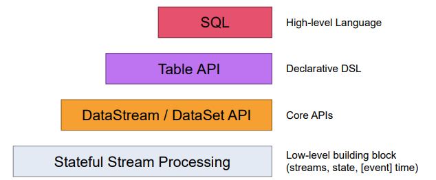

# Flink

## 搭建方案

### Local 单机搭建
#### [搭建Docker环境以及docker-compose](https://blog.csdn.net/yuell102/article/details/116572748?spm=1001.2014.3001.5501)
拉取镜像

```bash
docker pull flink:1.10.0-scala_2.12
```
创建目录
```bash
mkdir flink
```
```bash
cd flink
```
vi docker-compose.yml
注意保证8081端口未被占用
```bash
sudo vi docker-compose.yml
```
运行创建Flink容器
```bash
docker-compose up
```
如果出现异常 重启Docker
```bash
sudo systemctl restart docker 
```

## 介绍

### 特点及优势

1、同时支持高吞吐、低延迟、高性能 

2、支持事件时间（Event Time）概念，结合Watermark处理乱序数据 

3、支持有状态计算，并且支持多种状态 内存、文件、RocksDB 

4、支持高度灵活的窗口（Window）操作 time、count、session 

5、基于轻量级分布式快照（CheckPoint）实现的容错 保证exactly-once语义

6、基于JVM实现独立的内存管理 7、Save Points（保存点）

7、支持状态计算

#### 功能以及一些注意点

1、高吞吐量、低延迟、高性能 ：体现在社会的认可度，比如说阿里的收购，阿里双11大屏的使用，电商热点数据的实时更新，以及统计分析，对实时性要求非常高的需求

2、Watermark处理乱序数据可以有效的处理迟到数据，比如数据时间范围没收到

3、Window窗口可以处理时间段或者数量达到某个条件的数据

4、CheckPoint可以有效的解决，断开重连，保证无界流的正常执行

5、Sink发射点需要选择带有幂等或者手写幂等，来解决数据恰好一次（原子性）

6、source数据源需要选择可重复消费的数据源，比如Kafka，数据库，Redist，防止算子操作中挂掉，需要重新重发补偿数据

7、算子操作需要设置id，防止业务修改，无界流出现自建id找不到，导致无界流无法读取历史数据

8、算子操作尽量非特殊分区策略条件组成算子链，较少线程数，减少序列化以及反序列化

9、默认Points会存在JVM，尽量选择持久化，排除连续持久化

10、Flink中的算子分区策略广播有待测试，可以利用特性排序后再广播，可以更大的放开Kafka的分区

11、目前市场上大部分人用的Flink1.7，Flink1.8加入了阿里Blink部分贡献

### 核心图
Flink是完全的流处理开源框架;
分为有界流与无界流;

无状态计算 ：类比一下select操作，来一条，操作一条，数据不用留在系统里面。
有状态计算： 类比一下count，sum操作，这时候就需要缓存之前的数据，才可以实现，这样的计算就是有状态的。


```mermaid
flowchart TD;

subgraph Flink是完全流处理的开源框架;
流处理-->|无界|普通流处理Stream;
流处理-->|有界|特殊流处理=批处理Batch;
普通流处理Stream -->有状态计算 & 无状态计算;
特殊流处理=批处理Batch -->有状态计算 & 无状态计算;
end
```

### 组件分布图

#### Runtime层 

Runtime层提供了支持Flink计算的全部核心实现，比如：支持分布式Stream处理、JobGraph到ExecutionGraph的映射、调度等等，为上层API层提供基础服务

#### API层

API层主要实现了面向无界Stream的流处理和面向Batch的批处理API，其中面向流处理对应DataStream API，面向批处理对应DataSet API 

#### Libaries层 

* 在API层之上构建的满足特定应用的实现计算框架，也分别对应于面向流处理和面向批处理两类

* 面向流处理支持：CEP（复杂事件处理）、基于SQL-like的操作（基于Table的关系操作）

* 面向批处理支持：FlinkML（机器学习库）、Gelly（图处理）

### 调用层级概括图


##### Stateful Stream Processing（最底层的算子）
最低级的抽象接口是状态化的数据流接口（statefulstreaming）。这个接口是通过 ProcessFunction 集成到 DataStream API 中的。该接口允许用户自由的处理来自一个或多个流中的事件，并使用一致的容错状态。另外，用户也可以通过注册event time 和 processing time 处理回调函数的方法来实现复杂的计算
##### DataStream/DataSet API DataStream / DataSet API（基本算子层）
是 Flink 提供的核心 API ，DataSet 处理有界的数据集，DataStream 处理有界或者无界的数据流。用户可以通过各种方法（map /flatmap / window / keyby / sum / max / min / avg / join 等）将数据进行转换 / 计算

##### Table API(表层)
Table API 提供了例如 select、project、join、group-by、aggregate 等操作，使用起
来却更加简洁,可以在表与 DataStream/DataSet 之间无缝切换，也允许程序将 Table API 与
DataStream 以及 DataSet 混合使用

##### SQL层
SQL Flink 提供的最高层级的抽象是 SQL 。这一层抽象在语法与表达能力上与 Table API 类似。
SQL 抽象与 Table API 交互密切，同时 SQL 查询可以直接在 Table API 定义的表上执行

#### 调用执行图


#### 代码编写概括图

```java
//1.在Flink的世界观中，一切都是数据流。所以对于批计算来说，那只是流计算的一个特例。
//2.Flink Dataflows是由三部分组成，分别是：source、transformation、sink结束。
//3.source数据源会源源不断的产生数据，transformation将产生的数据进行各种业务逻辑的数据处理，最 终由sink输出到外部（console、kafka、redis、DB......） 基于Flink开发的程序都能够映射成一个Dataflows
```


#### 并行度图

sink记得考虑数据幂等

#### Flink并行度设置方式

1. 在算子上设置
```scala
val wordStream = initStream.flatMap(_.split(" ")).setParallelism(2)
```
2. 在上下文环境中设置
```scala
val env = StreamExecutionEnvironment.getExecutionEnvironment
env.setParallelism(1)
```
3. client提交Job时设置

```b
flink run -c com.msb.stream.WordCount -p 3 StudyFlink-1.0-SNAPSHOT.jar
```
4. 在flink-conf.yaml配置文件中设置

```java
parallelism.default: 1
```
## Dataflows DataSource数据源

Flink内嵌支持的数据源非常多，比如HDFS、Socket、Kafka、Collections Flink也提供了addSource方 式，可以自定义数据源，本小节将讲解Flink所有内嵌数据源及自定义数据源的原理及API

### File Source

### Collection Source

### Socket Source

### Kafka Source

### Custom Source


## [算子 Dataflows Transformations](https://gitee.com/valuenull/demo/blob/origin/flink_demo/src/main/java/com/flink/arithmetic)

### [Map DataStream → DataStream](https://gitee.com/valuenull/demo/blob/origin/flink_demo/src/main/java/com/flink/arithmetic/MapDemo.java)
遍历数据流中的每一个元素，产生一个新的元素 
```java
        //构建环境
        ExecutionEnvironment env = ExecutionEnvironment.getExecutionEnvironment();

        //通过字符串构建数据集
        DataSet<String> text = env.fromElements(
                "Who's there? I think I hear them. Stand, ho! Who's there?");


        //分割字符串、按照key进行分组、统计相同的key个数
        DataSet<Integer> map = text
                .map(new MapFunction<String, Integer>() {
                    @Override
                    public Integer map(String s) throws Exception {
                        String[] split = s.split(" ");
                        return split.length;
                    }
                });

        //打印
        map.print();
```
运算结果
```java
//  11
```
### [FlatMap DataStream → DataStream](https://gitee.com/valuenull/demo/blob/origin/flink_demo/src/main/java/com/flink/arithmetic/FlatMapDemo.java)
```java
 //构建环境
        ExecutionEnvironment env = ExecutionEnvironment.getExecutionEnvironment();
        //通过字符串构建数据集
        DataSet<String> text = env.fromElements(
                "Who's there?",
                "I think I hear them. Stand, ho! Who's there?");


        //分割字符串、按照key进行分组、统计相同的key个数
        DataSet<Tuple2<String, Integer>> wordCounts = text
                .flatMap(new FlatMapFunction<String, Tuple2<String, Integer>>() {
                    @Override
                    public void flatMap(String s, Collector<Tuple2<String, Integer>> out) throws Exception {
                        for (String word : s.split(" ")) {
                            out.collect(new Tuple2<String, Integer>(word, 1));
                        }
                    }
                });

        //打印
        wordCounts.print();
```
输出结果
```java
// 输出结果
//            (Who's,1)
//            (there?,1)
//            (I,1)
//            (think,1)
//            (I,1)
//            (hear,1)
//            (them.,1)
//            (Stand,,1)
//            (ho!,1)
//            (Who's,1)
//            (there?,1)
```
遍历数据流中的每一个元素，产生N个元素 N=0，1，2,......
### [Filter DataStream → DataStream](https://gitee.com/valuenull/demo/blob/origin/flink_demo/src/main/java/com/flink/arithmetic/FilterDemo.java) 
过滤算子，根据数据流的元素计算出一个boolean类型的值，true代表保留，false代表过滤掉
```java
//构建环境
        ExecutionEnvironment env = ExecutionEnvironment.getExecutionEnvironment();
        env.setParallelism(1);

        //通过字符串构建数据集
        DataSet<String> text = env.fromElements(
                "Who's there? I think I hear them. Stand, ho! Who's there?");


        //分割字符串、按照key进行分组、统计相同的key个数
        DataSet<Tuple2<String, Integer>> map = text
                .flatMap(new FlatMapFunction<String, Tuple2<String, Integer>>() {
                    @Override
                    public void flatMap(String s,  Collector<Tuple2<String, Integer>> out) throws Exception {
                        for (String s1 : s.split(" ")) {
                            out.collect(new Tuple2<String, Integer>(s1.toString(), 1));
                        }
                    }
                })
                .filter((s) -> !s.toString().contains("I"));

        //打印
        map.print();
```
输出结果
```java
//            (Who's,1)
//            (there?,1)
//            (think,1)
//            (hear,1)
//            (them.,1)
//            (Stand,,1)
//            (ho!,1)
//            (Who's,1)
//            (there?,1)
```
### [KeyBy DataStream → KeyedStream](https://gitee.com/valuenull/demo/blob/origin/flink_demo/src/main/java/com/flink/arithmetic/KeyByDemo1.java)
主要事根据指定字段或者下标，来分分区或者线程处理

根据数据流中指定的字段来分区，相同指定字段值的数据一定是在同一个分区中，内部分区使用的是 HashPartitioner

#### [KeyBy Demo1](https://gitee.com/valuenull/demo/blob/origin/flink_demo/src/main/java/com/flink/arithmetic/KeyByDemo1.java)
```java
        //构建环境
        StreamExecutionEnvironment env = StreamContextEnvironment.getExecutionEnvironment();
                //设置分区
//        env.setParallelism(1);
                DataStream<String> stream = env.fromElements("Who's there? I think I hear them. Stand, ho! Who's there?");

        //算子运算
        DataStream<Tuple2<String, Integer>> dataStream = stream.flatMap(new FlatMapFunction<String, Tuple2<String, Integer>>() {
@Override
public void flatMap(String s, Collector<Tuple2<String, Integer>> out) throws Exception {
        for (String word : s.split(" ")) {
        out.collect(new Tuple2<String, Integer>(word, 1));
        }
        }
        })
        //设置id
        .uid("map")
        //设置分区
//                .setParallelism(1)

//                //根据value 分组
//                .keyBy(1)
//                //根据value 聚合
//                .sum(1);

        //根据key 分组
        .keyBy(0);


        //打印
        dataStream.print();

        //执行
        env.execute();
        }
```
运行结果
```java
//        1> (hear,1)
//        7> (think,1)
//        7> (Stand,,1)
//        6> (Who's,1)
//        6> (there?,1)
//        6> (Who's,1)
//        6> (there?,1)
//        3> (I,1)
//        3> (I,1)
//        3> (them.,1)
//        3> (ho!,1)
```

#### [KeyBy Demo2](https://gitee.com/valuenull/demo/blob/origin/flink_demo/src/main/java/com/flink/arithmetic/KeyByDemo2.java)
```java
    //构建环境
    StreamExecutionEnvironment env = StreamExecutionEnvironment.getExecutionEnvironment();

    //算子运算
    env.fromElements(Tuple2.of(2L, 3L), Tuple2.of(1L, 3L), Tuple2.of(3L, 3L), Tuple2.of(2L, 4L), Tuple2.of(1L, 4L), Tuple2.of(1L, 3L))
    .keyBy(0) // 以数组的第一个元素作为key
//                .keyBy(1) // 以数组的第一个元素作为key
    .map((MapFunction<Tuple2<Long, Long>, String>) longLongTuple2 -> "key:" + longLongTuple2.f0 + ",value:" + longLongTuple2.f1).uid("map")
    .print();
    
    //开始执行
    env.execute("execute");
```
执行结果
```java
//        8> key:2,value:3
//        8> key:3,value:3
//        8> key:2,value:4
//        6> key:1,value:3
//        6> key:1,value:4
//        6> key:1,value:3
```

#### [KeyBy Demo3](https://gitee.com/valuenull/demo/blob/origin/flink_demo/src/main/java/com/flink/arithmetic/KeyByDemo2.java)
```java
    //构建环境
    StreamExecutionEnvironment env = StreamExecutionEnvironment.getExecutionEnvironment();

    //算子运算
    env.fromElements(Tuple2.of(2L, 3L), Tuple2.of(1L, 3L), Tuple2.of(3L, 3L), Tuple2.of(2L, 4L), Tuple2.of(1L, 4L), Tuple2.of(1L, 3L))
//        .keyBy(0) // 以数组的第一个元素作为key
    .keyBy(1) // 以数组的第一个元素作为key
    .map((MapFunction<Tuple2<Long, Long>, String>) longLongTuple2 -> "key:" + longLongTuple2.f0 + ",value:" + longLongTuple2.f1).uid("map")
    .print();
    
    //开始执行
    env.execute("execute");
```
执行结果
```java
//        8> key:2,value:3
//        1> key:2,value:4
//        1> key:1,value:4
//        8> key:1,value:3
//        8> key:3,value:3
//        8> key:1,value:3
```
### [Reduce](https://gitee.com/valuenull/demo/blob/origin/flink_demo/src/main/java/com/flink/arithmetic/ReduceDemo.java)
KeyedStream：根据key分组 → DataStream

合并流  

注意，reduce是基于分区后的流对象进行聚合，也就是说，DataStream类型的对象无法调用reduce方 法
```java
    //创建环境
    StreamExecutionEnvironment env = StreamExecutionEnvironment.getExecutionEnvironment();

    //流计算
    env.fromElements(Tuple2.of(2L, 3L), Tuple2.of(1L, 5L), Tuple2.of(1L, 7L), Tuple2.of(2L, 4L), Tuple2.of(1L, 2L))
            .keyBy(0) // 以数组的第一个元素作为key
            .reduce((ReduceFunction<Tuple2<Long, Long>>) (t1, t2) -> new Tuple2<>(t1.f0, t1.f1 + t2.f1)).uid("reduce") // value做累加
            .print();

    //执行
    env.execute("execute");
```
执行结果
合并value
```java
//        6> (1,5)
//        6> (1,12)
//        6> (1,14)
//        8> (2,3)
//        8> (2,7)
```
### [Aggregations](https://gitee.com/valuenull/demo/blob/origin/flink_demo/src/main/java/com/flink/arithmetic/AggregateDemo.java)

KeyedStream → DataStream Aggregations代表的是一类聚合算子
```java
//创建环境
ExecutionEnvironment env = ExecutionEnvironment.getExecutionEnvironment();

        //批计算
        env.fromElements(
        Tuple2.of(1L, 4L),
        Tuple2.of(1L, 5L),
        Tuple2.of(1L, 6L),
        Tuple2.of(2L, 7L),
        Tuple2.of(2L, 3L),
        Tuple2.of(2L, 4L)
        )
        //根据key分组
        .groupBy(0)
        //查询每组数据key最大  value最小的值
        .aggregate(Aggregations.MAX, 0)
        .and(Aggregations.MIN, 1)
        .print();
```
执行结果

根据key分组 查询每组数据key最大  value最小的值
```java
//  (1,4)
//  (2,3)
```
### [Union 真合并](https://gitee.com/valuenull/demo/blob/origin/flink_demo/src/main/java/com/flink/arithmetic/UnionDemo.java)

DataStream* → DataStream Union of two or more data streams creating a new stream containing all the elements from all the streams 合并两个或者更多的数据流产生一个新的数据流，这个新的数据流中包含了所合并的数据流的元素 注意：需要保证数据流中元素类型一致

```java
ExecutionEnvironment env = ExecutionEnvironment.getExecutionEnvironment();

        DataSet<Tuple2<Long, String>> source1 = env.fromElements(
                Tuple2.of(1L, "张三"),
                Tuple2.of(2L, "李四"));

        DataSet<Tuple2<Long, String>> source2 = env.fromElements(
                Tuple2.of(1L, "王五"),
                Tuple2.of(2L, "曹六"));

        //合并  并且打印
        source1.union(source2).print();
```
//运行结果
```java
//(1,张三)
//(1,王五)
//(2,李四)
//(2,曹六)
```
### [Connect 假合并](https://gitee.com/valuenull/demo/blob/origin/flink_demo/src/main/java/com/flink/arithmetic/ConnectDemo.java)

DataStream,DataStream → ConnectedStreams 合并两个数据流并且保留两个数据流的数据类型，能够共享两个流的状态

1.函数等于算子
2.算子要指定id,虽然Flink会根据结构生成算子id,但是代码升级,代码机构发生改变后，生成的id会不同，导致新项目无法使用之前的流处理
3.算子并行度
4.算子链
5.算子分区策略
```java
 StreamExecutionEnvironment env = StreamExecutionEnvironment.getExecutionEnvironment();

        DataStream<Tuple2<Long, String>> source1 = env.fromElements(
                Tuple2.of(1L, "张三"),
                Tuple2.of(2L, "李四"));

        DataStream<Tuple2<Integer, String>> source2 = env.fromElements(
                Tuple2.of(1, "王五"),
                Tuple2.of(2, "曹六"));

        //合并  并且打印
        source1.connect(source2);

        source1.print();

        env.execute("execute");
```
执行结果
```java
//2> (1,张三)
//3> (2,李四)
```

### [CoMap, CoFlatMap](https://gitee.com/valuenull/demo/blob/origin/flink_demo/src/main/java/com/flink/arithmetic/CoMapDemo.java)

ConnectedStreams → DataStream CoMap, 

CoFlatMap并不是具体算子名字，而是一类操作名称

凡是基于ConnectedStreams数据流做map遍历，这类操作叫做CoMap

凡是基于ConnectedStreams数据流做flatMap遍历，这类操作叫做CoFlatMap
```java
StreamExecutionEnvironment env = StreamExecutionEnvironment.getExecutionEnvironment();

        DataStream<Tuple2<Long, String>> source1 = env.fromElements(
                Tuple2.of(1L, "张三"),
                Tuple2.of(2L, "李四"));

        DataStream<Tuple2<Integer, String>> source2 = env.fromElements(
                Tuple2.of(1, "王五"),
                Tuple2.of(2, "曹六"));

        //合并  并且打印
        DataStream<Tuple2<Integer, String>> dataStream = source1.connect(source2).map(
            new CoMapFunction<Tuple2<Long, String>, Tuple2<Integer, String>, Tuple2<Integer, String>>() {
                @Override
                public Tuple2<Integer, String> map1(Tuple2<Long, String> value) throws Exception {
                    return new Tuple2<Integer, String>(Math.toIntExact(value.f0), value.f1);
                }

                @Override
                public Tuple2<Integer, String> map2(Tuple2<Integer, String> value) throws Exception {
                    return new Tuple2<Integer, String>(Math.toIntExact(value.f0), value.f1);
                }
            }
        );

        //打印
        dataStream.print();

        //执行
        env.execute();
```
运行结果
```java
//1> (1,张三)
//7> (2,曹六)
//6> (1,王五)
//2> (2,李四)
```
### [Iterate](https://gitee.com/valuenull/demo/blob/origin/flink_demo/src/main/java/com/flink/arithmetic/IterationDemo.java)

DataStream → IterativeStream → DataStream 

Iterate算子提供了对数据流迭代的支持 迭代由两部分组成：迭代体、终止迭代条件 不满足终止迭代条件的数据流会返回到stream流中，

进行下一次迭代 满足终止迭代条件的数据流继续往下游发送
```java
//创建环境
        StreamExecutionEnvironment env = StreamExecutionEnvironment.getExecutionEnvironment();

        //创建1到10的数据
        DataStream<Long> dataStream = env.fromSequence(1L, 10L);
        IterativeStream<Long> iteration = dataStream.iterate();
        DataStream<Long> iterationBody = iteration.map (x->x);
        DataStream<Long> feedback = iterationBody.filter(new FilterFunction<Long>(){
            @Override
            public boolean filter(Long value) throws Exception {
                return value > 9;
            }
        });
        //放入 closeWith中会一直在循环
        iteration.closeWith(feedback);
        DataStream<Long> output = iterationBody.filter(new FilterFunction<Long>(){
            @Override
            public boolean filter(Long value) throws Exception {
                return value < 2;
            }
        });
        //放入 closeWith中会一直在循环
        iteration.closeWith(output);

        output.print();
        iteration.print();

        //执行
        env.execute();
```
运行结果
```java
//输出 1和 10 无线循环
//5> 1
//5> 1
//8> 10
//5> 1
//5> 1
//8> 10
//5> 1
//5> 1
//8> 10
//5> 1
//5> 1
//8> 10
//5> 1
//5> 1
//8> 10
```

### [side output侧输出流](https://gitee.com/valuenull/demo/blob/origin/flink_demo/src/main/java/com/flink/arithmetic/SideOutputDemo.java)

生成一条主流，一条测流，Split已被标弃用，用于代替Split+Select
```java
LocalStreamEnvironment env = StreamExecutionEnvironment.createLocalEnvironment();

        DataStream<Tuple2<Long, Long>> dataStream = env
                .fromElements(
                        Tuple2.of(2L, 3L),
                        Tuple2.of(1L, 3L),
                        Tuple2.of(3L, 3L),
                        Tuple2.of(2L, 4L),
                        Tuple2.of(1L, 4L),
                        Tuple2.of(4L, 4L),
                        Tuple2.of(5L, 4L),
                        Tuple2.of(6L, 4L),
                        Tuple2.of(1L, 3L)
                );
        
        SingleOutputStreamOperator<String> process = dataStream.process(
                new ProcessFunction<Tuple2<Long, Long>, String>() {
                    @Override
                    public void processElement(Tuple2<Long, Long> v, Context context, Collector<String> collector) throws Exception {
                        switch (v.f0.toString()){
                            case "1":
                                context.output(new OutputTag<String>("1"){}, v + "属于1L");
                                break;
                            case "2":
                                context.output(new OutputTag<String>("2"){}, v + "属于2L");
                                break;
                            case "3":
                                context.output(new OutputTag<String>("3"){}, v + "属于3L");
                                break;
                            case "4":
                                context.output(new OutputTag<String>("4"){}, v + "属于4L");
                                break;
                            default:
                                collector.collect(v + "不小于5L");
                                break;
                        }
                    }
                }
        );
        process.print("5");
        process.getSideOutput(new OutputTag<String>("1"){}).print("1");
        process.getSideOutput(new OutputTag<String>("2"){}).print("2");
        process.getSideOutput(new OutputTag<String>("3"){}).print("3");
        process.getSideOutput(new OutputTag<String>("4"){}).print("4");

        env.execute("execute");
    }
```
运行结果
```java
//2:4> (2,3)属于2L
//1:5> (1,3)属于1L
//1:4> (1,3)属于1L
//4:1> (4,4)属于4L
//3:6> (3,3)属于3L
//2:7> (2,4)属于2L
//1:8> (1,4)属于1L
//5:3> (6,4)不小于5L
//5:2> (5,4)不小于5L
```

### 底层API(ProcessFunctionAPI)

类似与自定义算子，无法满足时使用

属于低层次的API，我们前面讲的map、filter、flatMap等算子都是基于这层高层封装出来的 越低层次的API，功能越强大，用户能够获取的信息越多。

比如：可以拿到元素状态信息、事件时间、设 置定时器等

### 函数类和富函数类

在使用Flink算子的时候，可以通过传入匿名函数和函数类对象

函数类分为：普通函数类、富函数类（自行划分）

富函数类相比于普通的函数，可以获取运行环境的上下文（Context），拥有一些生命周期方法，管理 状态，可以实现更加复杂的功能

普通函数类：没有生命周期方法

富函数类：有open(),close()等生命周期方法，利于解决一些执行前处理，执行后处理

如：执行前打开连接    执行后关闭资源


| 普通函数类 | 富函数类 |
|  ----  | ----  |
| MapFunction | RichMapFunction |
| FlatMapFunction | RichFlatMapFunction |
| FilterFunction | RichFilterFunction |
| ....... | ........ |

## Dataflows Sink

Flink内置了大量sink，可以将Flink处理后的数据输出到HDFS、kafka、Redis、ES、MySQL等等 工程场景中，会经常消费kafka中数据，处理结果存储到Redis或者MySQL中

### Redis Sink

### Kafka Sink

### MySQL Sink（幂等性）

### Socket Sink

### File Sink

### HBase Sink

## Dataflows分区策略

### 增加并行度，解决数据倾斜问题分区策略

#### shuffle随意分发

场景：增大分区、提高并行度，解决数据倾斜，上游数据比较随意的分发到下游

DataStream → DataStream

分区元素随机均匀分发到下游分区，网络开销比较大

#### rebalance均匀分发

场景：增大分区、提高并行度，解决数据倾斜 、上游数据比较均匀的分发到下游

DataStream → DataStream 

轮询分区元素，均匀的将元素分发到下游分区，下游每个分区的数据比较均匀，在发生数据倾斜时非常 有用，网络开销比较大

### 降低网络IO，优先本地分区策略

#### rescale优先本地

场景：减少分区 防止发生大量的网络传输 不会发生全量的重分区 

DataStream → DataStream

 通过轮询分区元素，将一个元素集合从上游分区发送给下游分区，发送单位是集合，而不是一个个元素

 注意：rescale发生的是本地数据传输，而不需要通过网络传输数据，比如taskmanager的槽数。简单 来说，上游的数据只会发送给本TaskManager中的下游

### 广播分区，所有算子分区收到相同数据分区策略

#### broadcast广播

场景：需要使用映射表、并且映射表会经常发生变动的场景 

DataStream → DataStream

上游中每一个元素内容广播到下游每一个分区中

### 降低并行度分区策略

#### global 发送到算子中的第一个分区

场景：并行度降为1 

DataStream → DataStream

上游分区的数据只分发给下游的第一个分区

同一个算子无论你有多少个分区，我只发送给第一个

### 一一对应分区策略

#### forward 大多数分区默认，可以组成算子链

场景：一对一的数据分发，map、flatMap、filter 等都是这种分区策略

DataStream → DataStream

上游分区数据分发到下游对应分区中

保证上下游分区数一致，否则会报错

### Hash分区策略

#### keyBy 根据Key的哈希

场景：与业务场景匹配

 DataStream → DataStream

根据上游分区元素的Hash值与下游分区数取模计算出，将当前元素分发到下游哪一个分区

根据元素Hash值分发到下游分区中

### 自定义分区策略

#### PartitionCustom 

DataStream → DataStream

通过自定义的分区器，来决定元素是如何从上游分区分发到下游分区

进入底层自己实现分区策略

## Flink中的窗口


### 窗口类型

1.flink支持两种划分窗口的方式（time和count）

根据时间time

根据数据数量

2.flink支持窗口的两个重要属性（size和interval）

* 如果size=interval,那么就会形成tumbling-window(无重叠数据)    
* 如果size>interval,那么就会形成sliding-window(有重叠数据)    
* 如果size<interval,那么这种窗口将会丢失数据。比如每5秒钟，统计过去3秒的通过路口汽车的数据，将会漏掉2秒钟的数据。

3.通过组合可以得出四种基本窗口：

* `time-tumbling-window` 无重叠数据的时间窗口，设置方式举例：timeWindow(Time.seconds(5)) 

* `time-sliding-window`  有重叠数据的时间窗口，设置方式举例：timeWindow(Time.seconds(5), Time.seconds(3)) 


* `count-tumbling-window`无重叠数据的数量窗口，设置方式举例：countWindow(5)    

* `count-sliding-window` 有重叠数据的数量窗口，设置方式举例：countWindow(5,3)


1.不重叠窗口


2.重叠窗口


## Watermark水印与水位线

本文作者为阿里巴巴高级技术专家:金竹，原文发表在云栖社区。

地址为:https://yq.aliyun.com/articles/666056?spm=a2c4e.11155435.0.0.106e1b10snGqMd

### 实际问题（乱序）

在介绍Watermark相关内容之前我们先抛出一个具体的问题，在实际的流式计算中数据到来的顺序对计算结果的正确性有至关重要的影响，比如：某数据源中的某些数据由于某种原因(如：网络原因，外部存储自身原因)会有5秒的延时，也就是在实际时间的第1秒产生的数据有可能在第5秒中产生的数据之后到来(比如到Window处理节点).选具体某个delay的元素来说，假设在一个5秒的Tumble窗口(详见Window介绍章节)，有一个EventTime是 11秒的数据，在第16秒时候到来了。图示第11秒的数据，在16秒到来了，如下图：


那么对于一个Count聚合的Tumble(5s)的window，上面的情况如何处理才能window2=4，window3=2 呢？Apache Flink的时间类型
开篇我们描述的问题是一个很常见的TimeWindow中数据乱序的问题，乱序是相对于事件产生时间和到达Apache Flink 实际处理算子的顺序而言的，关于时间在Apache Flink中有如下三种时间类型，如下图：


那么对于一个Count聚合的Tumble(5s)的window，上面的情况如何处理才能window2=4，window3=2 呢？

### Apache Flink的时间类型

开篇我们描述的问题是一个很常见的TimeWindow中数据乱序的问题，乱序是相对于事件产生时间和到达Apache Flink 实际处理算子的顺序而言的，关于时间在Apache Flink中有如下三种时间类型，如下图：


* ProcessingTime 

是数据流入到具体某个算子时候相应的系统时间。ProcessingTime 有最好的性能和最低的延迟。但在分布式计算环境中ProcessingTime具有不确定性，相同数据流多次运行有可能产生不同的计算结果。

* IngestionTime

IngestionTime是数据进入Apache Flink框架的时间，是在Source Operator中设置的。与ProcessingTime相比可以提供更可预测的结果，因为IngestionTime的时间戳比较稳定(在源处只记录一次)，同一数据在流经不同窗口操作时将使用相同的时间戳，而对于ProcessingTime同一数据在流经不同窗口算子会有不同的处理时间戳。

* EventTime

EventTime是事件在设备上产生时候携带的。在进入Apache Flink框架之前EventTime通常要嵌入到记录中，并且EventTime也可以从记录中提取出来。在实际的网上购物订单等业务场景中，大多会使用EventTime来进行数据计算。

开篇描述的问题和本篇要介绍的Watermark所涉及的时间类型均是指EventTime类型。

### 什么是Watermark

Watermark是Apache Flink为了处理EventTime 窗口计算提出的一种机制,本质上也是一种时间戳，由Apache Flink Source或者自定义的Watermark生成器按照需求Punctuated或者Periodic两种方式生成的一种系统Event，与普通数据流Event一样流转到对应的下游算子，接收到Watermark Event的算子以此不断调整自己管理的EventTime clock。 Apache Flink 框架保证Watermark单调递增，算子接收到一个Watermark时候，框架知道不会再有任何小于该Watermark的时间戳的数据元素到来了，所以Watermark可以看做是告诉Apache Flink框架数据流已经处理到什么位置(时间维度)的方式。 Watermark的产生和Apache Flink内部处理逻辑如下图所示: 


### Watermark的产生方式

目前Apache Flink 有两种生产Watermark的方式，如下：

* Punctuated - 数据流中每一个递增的EventTime都会产生一个Watermark。 

在实际的生产中Punctuated方式在TPS很高的场景下会产生大量的Watermark在一定程度上对下游算子造成压力，所以只有在实时性要求非常高的场景才会选择Punctuated的方式进行Watermark的生成。

* Periodic - 周期性的（一定时间间隔或者达到一定的记录条数）产生一个Watermark。在实际的生产中Periodic的方式必须结合时间和积累条数两个维度继续周期性产生Watermark，否则在极端情况下会有很大的延时。

所以Watermark的生成方式需要根据业务场景的不同进行不同的选择。

### Watermark的接口定义

对应Apache Flink Watermark两种不同的生成方式，我们了解一下对应的接口定义，如下：

* Periodic Watermarks - AssignerWithPeriodicWatermarks

```
/**
* Returns the current watermark. This method is periodically called by the
* system to retrieve the current watermark. The method may return {@code null} to
* indicate that no new Watermark is available.
*
* &lt;p&gt;The returned watermark will be emitted only if it is non-null and itsTimestamp
* is larger than that of the previously emitted watermark (to preserve the contract of
* ascending watermarks). If the current watermark is still
* identical to the previous one, no progress in EventTime has happened since
* the previous call to this method. If a null value is returned, or theTimestamp
* of the returned watermark is smaller than that of the last emitted one, then no
* new watermark will be generated.
*
* &lt;p&gt;The interval in which this method is called and Watermarks are generated
* depends on {@link ExecutionConfig#getAutoWatermarkInterval()}.
*
* @see org.Apache.flink.streaming.api.watermark.Watermark
* @see ExecutionConfig#getAutoWatermarkInterval()
*
* @return {@code Null}, if no watermark should be emitted, or the next watermark to emit.
*/
@Nullable
Watermark getCurrentWatermark();
```

* Punctuated Watermarks - AssignerWithPunctuatedWatermarks 

```
public interface AssignerWithPunctuatedWatermarks&lt;T&gt; extendsTimestampAssigner&lt;T&gt; {

/**
* Asks this implementation if it wants to emit a watermark. This method is called right after
* the {@link #extractTimestamp(Object, long)} method.
*
* &lt;p&gt;The returned watermark will be emitted only if it is non-null and itsTimestamp
* is larger than that of the previously emitted watermark (to preserve the contract of
* ascending watermarks). If a null value is returned, or theTimestamp of the returned
* watermark is smaller than that of the last emitted one, then no new watermark will
* be generated.
*
* &lt;p&gt;For an example how to use this method, see the documentation of
* {@link AssignerWithPunctuatedWatermarks this class}.
*
* @return {@code Null}, if no watermark should be emitted, or the next watermark to emit.
*/
@Nullable
Watermark checkAndGetNextWatermark(T lastElement, long extractedTimestamp);
}
```

AssignerWithPunctuatedWatermarks 继承了TimestampAssigner接口 -TimestampAssigner


```
public interfaceTimestampAssigner&lt;T&gt; extends Function {

/**
* Assigns aTimestamp to an element, in milliseconds since the Epoch.
*
* &lt;p&gt;The method is passed the previously assignedTimestamp of the element.
* That previousTimestamp may have been assigned from a previous assigner,
* by ingestionTime. If the element did not carry aTimestamp before, this value is
* {@code Long.MIN_VALUE}.
*
* @param element The element that theTimestamp is wil be assigned to.
* @param previousElementTimestamp The previous internalTimestamp of the element,
* or a negative value, if noTimestamp has been assigned, yet.
* @return The newTimestamp.
*/
long extractTimestamp(T element, long previousElementTimestamp);
}
```

从接口定义可以看出，Watermark可以在Event(Element)中提取EventTime，进而定义一定的计算逻辑产生Watermark的时间戳。

### Watermark解决如上问题

从上面的Watermark生成接口和Apache Flink内部对Periodic Watermark的实现来看，Watermark的时间戳可以和Event中的EventTime 一致，也可以自己定义任何合理的逻辑使得Watermark的时间戳不等于Event中的EventTime，Event中的EventTime自产生那一刻起就不可以改变了，不受Apache Flink框架控制，而Watermark的产生是在Apache Flink的Source节点或实现的Watermark生成器计算产生(如上Apache Flink内置的 Periodic Watermark实现), Apache Flink内部对单流或多流的场景有统一的Watermark处理。

回过头来我们在看看Watermark机制如何解决上面的问题，上面的问题在于如何将迟来的EventTime 位11的元素正确处理。要解决这个问题我们还需要先了解一下EventTime window是如何触发的？ EventTime window 计算条件是当Window计算的Timer时间戳 小于等于 当前系统的Watermak的时间戳时候进行计算。 

* 当Watermark的时间戳等于Event中携带的EventTime时候，上面场景（Watermark=EventTime)的计算结果如下：


 上面对应的DDL(Alibaba 企业版的Flink分支)定义如下：


```
CREATE TABLE source(
...,
Event_timeTimeStamp,
WATERMARK wk1 FOR Event_time as withOffset(Event_time, 0) 
) with (
...
);
```

* 如果想正确处理迟来的数据可以定义Watermark生成策略为 Watermark = EventTime -5s， 如下：


上面对应的DDL(Alibaba 内部的DDL语法，目前正在和社区讨论)定义如下： 

```
CREATE TABLE source(
...,
Event_timeTimeStamp,
WATERMARK wk1 FOR Event_time as withOffset(Event_time, 5000) 
) with (
...
);
```

上面正确处理的根源是我们采取了 延迟触发 window 计算 的方式正确处理了 Late Event. 与此同时，我们发现window的延时触发计算，也导致了下游的LATENCY变大，本例子中下游得到window的结果就延迟了5s.

### 多流的Watermark处理

在实际的流计算中往往一个job中会处理多个Source的数据，对Source的数据进行GroupBy分组，那么来自不同Source的相同key值会shuffle到同一个处理节点，并携带各自的Watermark，Apache Flink内部要保证Watermark要保持单调递增，多个Source的Watermark汇聚到一起时候可能不是单调自增的，这样的情况Apache Flink内部是如何处理的呢？如下图所示：


Apache Flink内部实现每一个边上只能有一个递增的Watermark， 当出现多流携带Eventtime汇聚到一起(GroupBy or Union)时候，Apache Flink会选择所有流入的Eventtime中最小的一个向下游流出。从而保证watermark的单调递增和保证数据的完整性.如下图: 


本节以一个流计算常见的乱序问题介绍了Apache Flink如何利用Watermark机制来处理乱序问题. 本篇内容在一定程度上也体现了EventTime Window中的Trigger机制依赖了Watermark(后续Window篇章会介绍)。Watermark机制是流计算中处理乱序，正确处理Late Event的核心手段。