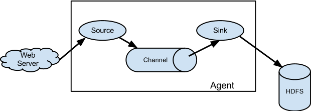

# Flume
主要应用于大数据传输
## Flume概念
```text
Flume 最早是Cludera提供的日志收集系统，后贡献给Apache。所以目前是Apache下的项目，Flume支持在日志系统中指定各类数据发送方，用于收集数据。

Flume 是一个高可用的，高可靠的，鲁棒性（robust健壮性），分布式的海量日志采集、聚合和传输的系统，Flume支持在日志系统中定制各类数据发送方，用于收集数据（source）；同时，Flume提供对数据进行简单处理，并写到各种数据接受仿的能力（sink）。
```

```text
flume是分布式的日志收集系统，它将各个服务器中的数据收集起来并送到指定的地方去，比如说送到图中的HDFS，简单来说flume就是收集日志的。
```
### Agent
```text
Agent 是一个JVM进程，它以事件的形式将数据从源头发送至目的地
Agent 主要有3个部分组成，Source、Channel、Sink
```
### Source
```text
Source 是负责接口数据到Flume Agent的组件。Source组件可以处理各种类型、各种格式日志数据。包括avro、thrift、exec、jms、spooling directory、netcat、sequence generator、syslog、http、legacy。
```
### Sink
```text
Sink 不断的轮询Channel中的事件且批量的移除它们，并将这些时间批量写入到存储中或索引系统、或者被发送到另一个Flume Agent
Sink 组件目的包括hdfs、logger、acro、thrift、ipc、file、HBase、solr、自定义
```
### Channel
````text

````
### Event