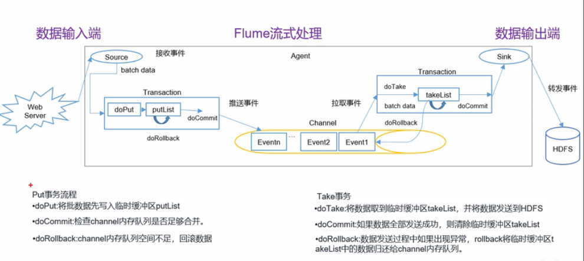

# 事务

## Put事务
```text
doPut: 将批数据先写入临时缓冲区putList
doCommit: 检查channel内存队列是否足够合并
doRollback: channel内存队列空间不足,回滚数据
```
## Take事务
```text
doTake: 将数据取到临时缓冲区takeList, 并将数据发送到HDFS
doCommit: 如果数据全部发送成功，则清除临时缓冲区takeList
*doRollback:数据发送过程中如果出现异常，rollback将临时缓冲区takeList中的数据归还给channel内存队列。
```
