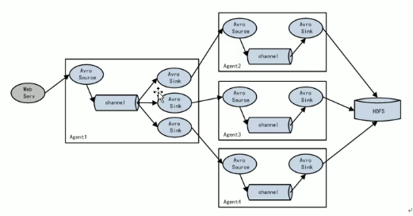
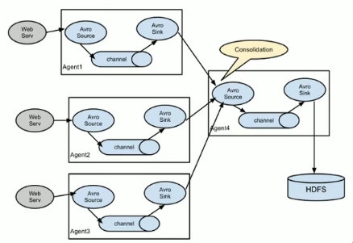

# [负载均衡](https://flume.apache.org/releases/content/1.9.0/FlumeUserGuide.html#load-balancing-sink-processor)

# [故障转移](https://flume.apache.org/releases/content/1.9.0/FlumeUserGuide.html#failover-sink-processor)
# [聚合]

