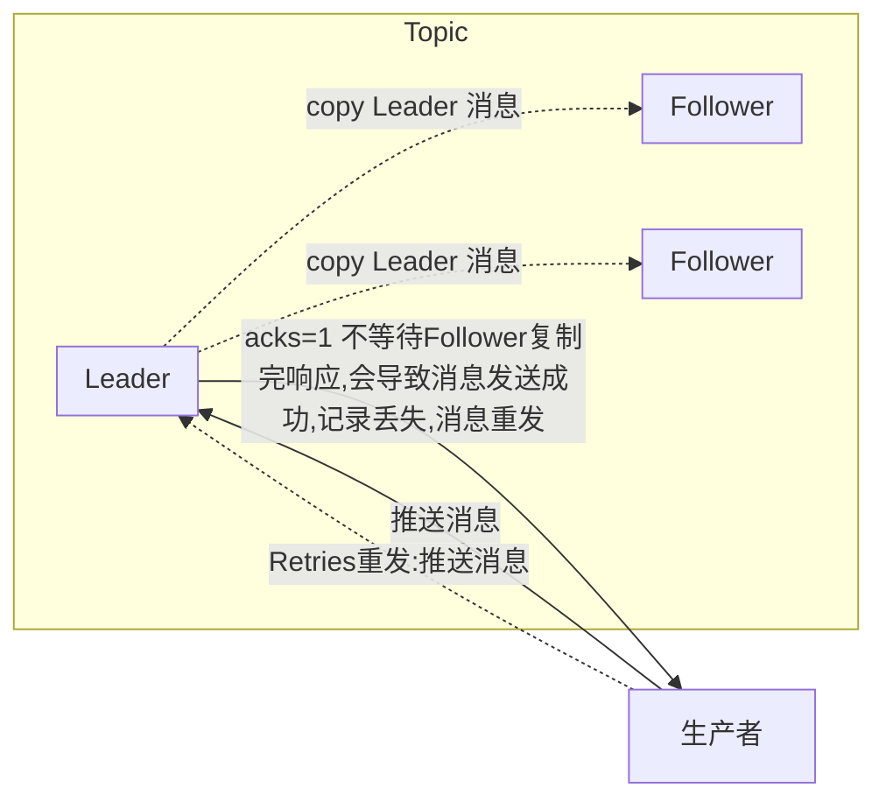
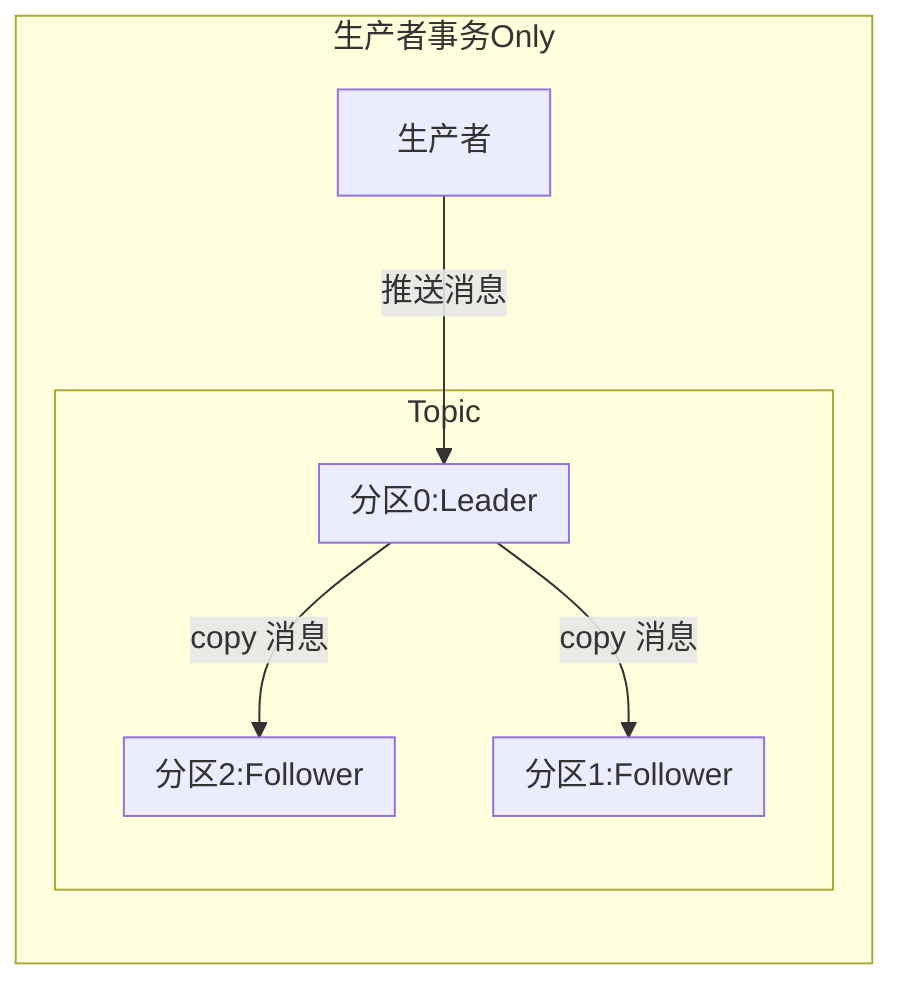
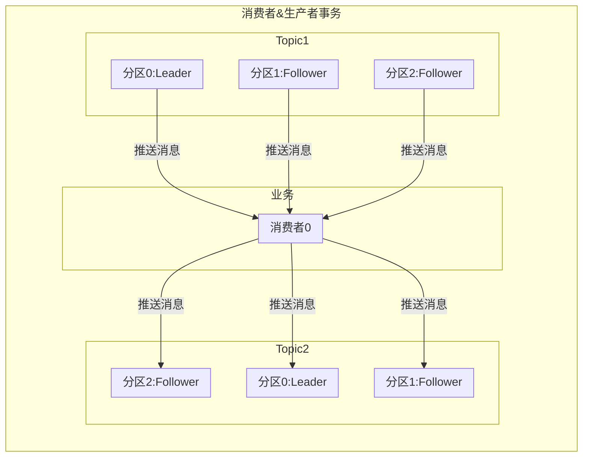

#Kafka
## [Topic管理](https://gitee.com/valuenull/demo/tree/origin/kafka_demo/src/main/java/com/kafka/kafka_demo/detailed)
### TopicDetailed
创建as Topic 3个分区 1个复制因子  默认异步
````java
adminClient.createTopics(Arrays.asList(new NewTopic("ac", 3, (short) 1)));
````
删除as Topic 默认异步
````java
adminClient.deleteTopics(Arrays.asList("ac"));
````
返回 Topic列表名称 默认异步
````java
ListTopicsResult listTopicsResult = adminClient.listTopics();
Set<String> names = listTopicsResult.names().get();
````
删除 Topic 默认异步
````java
describeTopics(Arrays.asList("ac"));
````
使其同步，等待执行完回来，返回结果
````java
xx.all().get();
````
## [简单  生产者/消费者](https://gitee.com/valuenull/demo/tree/origin/kafka_demo/src/main/java/com/kafka/kafka_demo/simple)
### 生产者 
#### ProducerQuickStart
推送给分区消息 有key走的时hash
````java
new ProducerRecord<>("ac", "key" + i, "value" + i);
````
推送消息 无key走的是其他策略（不一定是轮询  轮询策略）
````java
new ProducerRecord<>("ac", "value" + i);
````
//推送消息 指定分区推送 指定1分区
````java
new ProducerRecord<>("ac", 1, "key" + i, "value" + i);
````
### 消费者
#### ConsumerAssign 不配置消费组id 手动指定Topic分区 手动指定偏移量起始位值offset
1.assign手动指定消费分区  失去自动负载均衡
2.不能指定消费者组properties.put(ConsumerConfig.GROUP_ID_CONFIG, "c2");
```java
consumer.assign(topicPartitions);
```
3.指定消费偏移量 offset
指定消费位置  从头消费 从offset=0开始消费
```java
consumer.seekToBeginning(topicPartitions);
```
指定消费位置 1分区 从offset=5开始消费
```java
consumer.seek(new TopicPartition("ac", 1), 5);
```
从offset=当前最大  开始消费
```java
consumer.seekToEnd(topicPartitions);
```
#### ConsumerSubscribe  配置消费组id  自动负载管理Topic分区  无需指定偏移量offset
1.指定消费者分组id
```java
properties.put(ConsumerConfig.GROUP_ID_CONFIG, "c2");
```
2.订阅相关得Topics
一个topic多个分区时 一个消费组多个消费者时  subscribe订阅自动负载均衡
```java
consumer.subscribe(Pattern.compile("^ac.*"));
```
## [自定义分区 partitioner](https://gitee.com/valuenull/demo/tree/origin/kafka_demo/src/main/java/com/kafka/kafka_demo/partitioner)
### MyPartitioner
1.需要继承org.apache.kafka.clients.producer.Partitioner

2.重写或实现函数，可以参考org.apache.kafka.clients.producer.DefaultPartitioner

3.根据自己需求生产者配置，根据实现算法发送消息到期望的分区

4.配置自定义分区策略
```java
properties.put(ProducerConfig.PARTITIONER_CLASS_CONFIG, MyPartitioner.class.getName());
```
目前一直分区
```java
认分区策略：
如果记录中指定了分区，则使用它
如果未指定分区但存在键，则根据键的散列选择一个分区
如果不存在分区或键，请选择在批处理已满时更改的粘性分区。 有关粘性分区的详细信息，请参阅 KIP-480。
DefaultPartitioner


“循环”分区器 当用户希望将写入平均分配到所有分区时，可以使用此分区策略。 这是与记录键哈希无关的行为
RoundRobinPartitioner

分区策略：
如果记录中指定了分区，则使用它
否则选择当批处理已满时更改的粘性分区。 注意：与 DefaultPartitioner 相比，记录键不用作此分区器中分区策略的一部分。 不保证具有相同键的记录被发送到同一个分区。 有关粘性分区的详细信息，请参阅 KIP-480。
UniformStickyPartitioner
```
## [序列化](https://gitee.com/valuenull/demo/tree/origin/kafka_demo/src/main/java/com/kafka/kafka_demo/serializer)
### MySerializer  序列化
1.实现接口org.apache.kafka.common.serialization.Serializer

2.生产者需要增加
```java
//key传递序列化规则
properties.put(ProducerConfig.KEY_SERIALIZER_CLASS_CONFIG, MySerializer.class.getName());
//value传递序列化规则
properties.put(ProducerConfig.VALUE_SERIALIZER_CLASS_CONFIG, MySerializer.class.getName());
```
### MyDeserializer 反序列化
1.实现接口org.apache.kafka.common.serialization.Deserializer

2.消费者需要增加
```java
//key传递反序列化规则
properties.put(ConsumerConfig.KEY_DESERIALIZER_CLASS_CONFIG, MyDeserializer.class.getName());
//value传递反序列化规则
properties.put(ConsumerConfig.VALUE_DESERIALIZER_CLASS_CONFIG, MyDeserializer.class.getName());
```
## [拦截器](https://gitee.com/valuenull/demo/tree/origin/kafka_demo/src/main/java/com/kafka/kafka_demo/interceptors) 
### MyProducerInterceptor
1.需要实现接口：com.kafka.kafka_demo.interceptors.ProducerInterceptor

2.生产者需要增加
```java
//自定义拦截器
properties.put(ProducerConfig.INTERCEPTOR_CLASSES_CONFIG, MyProducerInterceptor.class.getName());
```
## [offset自动控制](https://gitee.com/valuenull/demo/tree/origin/kafka_demo/src/main/java/com/kafka/kafka_demo/offset)
```java
//默认 在消费者没有偏移量offset时生效
auto.offset.reset=latest
earliest:自动将偏移量重置为最早的偏移量
latest:自动将偏移量重置为最新的偏移量
none:如果未找到消费者组的先前偏移量,则消费者抛出异常

//默认 自动提交偏移量
enable.auto.commit=true
```
### ConsumerSubscribeOffSet  手动提交偏移量
1.关闭提交自动  会导致偏移量一直停留在已消费过的消息上面
```java
properties.put(ConsumerConfig.ENABLE_AUTO_COMMIT_CONFIG, false);
```
2.手动提交偏移量  偏移量一定要增加
```java
 //消息的偏移量
long offset = next.offset();

//这里必须++  每次重启都会导致最后一个消息重复消费
long count = ++offset;

//手动提交offset
Map<TopicPartition, OffsetAndMetadata> offsets=new HashMap<TopicPartition, OffsetAndMetadata>();

offsets.put(new TopicPartition(next.topic(), partition),new OffsetAndMetadata(count));
consumer.commitAsync(offsets, new OffsetCommitCallback() {
    @Override
    public void onComplete(Map<TopicPartition, OffsetAndMetadata> offsets, Exception exception) {
        System.out.println("完成："+count+"提交！");
    }
});
```

### ConsumerSubscribeOffSetDelay 延迟提交偏移量
1.自动提交offset 默认为true
```java
properties.put(ConsumerConfig.ENABLE_AUTO_COMMIT_CONFIG, true);
```
2.自动提交时生效 offset 偏移量提交频次 10000毫秒提交一次  提交前，每次打开都会消费没提交的消息  10秒内重起会重复消费
```java
properties.put(ConsumerConfig.AUTO_COMMIT_INTERVAL_MS_CONFIG, 10000);
```
## [应答与重发（Acks&Retries）与幂等](https://gitee.com/valuenull/demo/tree/origin/kafka_demo/src/main/java/com/kafka/kafka_demo/acks)
### ProducerAcks概括
```java
//Kafka生成这在发送完一个消息之后，要求Broker在规定的时间Ack应答，如果规定时间内没有应答，Kafka生产这会尝试N次重新发送消息

//acks=1   只要Leader确认
//Leader 会将Record写到其本地日志中，但会在不等待所有Follower的完全确认情况下做出响应，在这种情况下，如果Leader在确认记录后立即失败，但Follower复制记录之前失败，则记录将丢失

//acks=0   不需要任何确认
//生产者根本不会等待服务器的任何确认。该记录将立即添加到套接字缓存区中并视为已发送。这种情况下，不能保证服务器已收到记录

//acks=all   acks=-1  需要Leader和至少一个副本确认
//Leader将等待全套同步副本确认记录。这保证只要至少一个同步副本仍处于活动那个状态，记录不会丢失，这是最有力的保证

//request.timeout.ms=30000 默认ack超时时间  如果30秒未收到确认重发
//retries=2147483647 默认重试次数
```
图画的有点问题，仅供参考acks=1


图画的有点问题，仅供参考acks=0
```mermaid
flowchart LR
生产者,acks=0,不等待任何确认 -.->|推送消息| Leader;
生产者,acks=0,不等待任何确认 -.->|Retries重发:推送消息|Leader;
Leader -.->|copy Leader 消息| Follower0;
Leader -.->|copy Leader 消息| Follower1;
subgraph Topic;
    subgraph Leader;
    end
    subgraph Follower0[Follower];
    end
    subgraph Follower1[Follower];
    end
end
```

图画的有点问题，仅供参考acks=all | acks=-1
```mermaid
flowchart LR
生产者,acks=-1,等待至少一个副本分区确认,记录不会丢失 -->|推送消息| Leader;
Leader -->|copy Leader 消息| Follower0;
Leader -->|copy Leader 消息| Follower1;
subgraph Topic;
    subgraph Leader;
    end
    subgraph Follower0[Follower];
    end
    subgraph Follower1[Follower];
    end
end
```
### ProducerAcks 生产者配置
1.设置应答模式 需要Leader和至少一个副本确认
```java
properties.put(ProducerConfig.ACKS_CONFIG, "all");
```
2.重发次数3次 如果超过3次也失败,则系统放弃发送
```java
properties.put(ProducerConfig.RETRIES_CONFIG, 3);
```
3.将检测超时的时间设置为1毫秒
```java
properties.put(ProducerConfig.REQUEST_TIMEOUT_MS_CONFIG, 1);
```
### ProducerAcksIdempotent 幂等 生产者配置  //设置应答模式 需要Leader和至少一个副本确认
1.必须配置为 all 保证Leader和至少一个副本确认都确认收到消息
```java
properties.put(ProducerConfig.ACKS_CONFIG, "all");
```
2.必须设置重发次数  这里设置的是3
```java
properties.put(ProducerConfig.RETRIES_CONFIG, 3);
```
3.开启Kafka的幂等性       
```java
properties.put(ProducerConfig.ENABLE_IDEMPOTENCE_CONFIG, true);
```
4.必须设置为1 才能保证顺序 限制客户端在单个连接上能够发送的未响应请求的个数。设置此值是1表示kafka broker在响应请求之前client不能再向同一个broker发送请求。注意：设置此参数是为了避免消息乱序
```java
properties.put(ProducerConfig.MAX_IN_FLIGHT_REQUESTS_PER_CONNECTION, 1);
```        
## [事务](https://gitee.com/valuenull/demo/tree/origin/kafka_demo/src/main/java/com/kafka/kafka_demo/transactions)
```java
//Kafka的幂等，只能保证一条记录在分区发送的原子性
//多条记录多分区之间的完整性，需要开启kafka的事务操作
```
事务种类图



事务隔离级别
```java
isolation.level = read_uncommitted; //默认 事务读未提交   可以读到未提交事务的数据

isolation.level = read_committed; //事务读已提交   可以读到已提交事务的数据，未提交的读不到
```
### [生产者事务Only](https://gitee.com/valuenull/demo/tree/origin/kafka_demo/src/main/java/com/kafka/kafka_demo/transactions)
#### [读未提交ConsumerSubscribeReadUnCommitted](https://gitee.com/valuenull/demo/blob/origin/kafka_demo/src/main/java/com/kafka/kafka_demo/transactions/ConsumerSubscribeReadUnCommitted.java)
//消费事务的隔离级别read_committed  读未提交
```java
properties.put(ConsumerConfig.ISOLATION_LEVEL_CONFIG, "read_uncommitted");
```
#### [读已提交ConsumerSubscribeReadCommitted](https://gitee.com/valuenull/demo/blob/origin/kafka_demo/src/main/java/com/kafka/kafka_demo/transactions/ConsumerSubscribeReadCommitted.java)
//消费事务的隔离级别read_committed  读已提交
```java
properties.put(ConsumerConfig.ISOLATION_LEVEL_CONFIG, "read_committed");
```
#### [生产者ProducerT](https://gitee.com/valuenull/demo/blob/origin/kafka_demo/src/main/java/com/kafka/kafka_demo/transactions/ProducerT.java)
```java
//设置事务id  id必须唯一
properties.put(ProducerConfig.TRANSACTIONAL_ID_CONFIG, "transaction-id" + UUID.randomUUID().toString());
//配置Kafka批处理大小
properties.put(ProducerConfig.BATCH_SIZE_CONFIG, 1024);
//等待5ms  如果batch中数据不足 1024大小
properties.put(ProducerConfig.LINGER_MS_CONFIG, 5);

//配置Kafka重试机制和幂等性
properties.put(ProducerConfig.ENABLE_IDEMPOTENCE_CONFIG, true);
properties.put(ProducerConfig.ACKS_CONFIG, "all");
properties.put(ProducerConfig.REQUEST_TIMEOUT_MS_CONFIG, 20000);
```
### [消费者&生产者事务](https://gitee.com/valuenull/demo/tree/origin/kafka_demo/src/main/java/com/kafka/kafka_demo/transactions/c_and_p)
```java
//需要关闭第一个消费者的offset自动提交偏移量 手动+1维护偏移量
```
## SpringBoot 集成
### [消费者](https://gitee.com/valuenull/demo/blob/origin/kafka_demo/src/main/java/com/kafka/kafka_demo/listenner/KafkaListenner.java)
#### singleListenner 普通消费者
```java
/**
     * 监听 aa Topic
     * @param value
     */
    @KafkaListeners(value = {@KafkaListener(topics = {"aa"})})
    public void singleListenner(ConsumerRecord<?, ?> value) {
        log.info(value.value().toString());
    }
```
#### listenner 接收  处理后  发送给其他Topic
```java
/**
     * 接受 aa Topic 处理后发送给 bb Topic
     * @param value
     * @return
     */
    @KafkaListeners(value = {@KafkaListener(topics = {"aa"})})
    @SendTo(value = {"topic05"})
    public String listenner(ConsumerRecord<?, ?> value) {

        return value.value()+"我从aa处理后过来的！";
    }
```
### [生产者](https://gitee.com/valuenull/demo/blob/origin/kafka_demo/src/test/com/KafkaTempolateTests.java)
#### 非事务发送
```java
    /**
     *  非事物发送
     *   配 transaction-id-prefix 会报错
     */
    @Test
    public void testNotTransaction(){
        kafkaTemplate.send(new ProducerRecord("aa","003","非事务消息"));
    }
```
#### 事务发送
```java
 /**
     *  kafka事物发送
     */
    @Test
    public void testKafkaTemplate(){
        kafkaTemplate.executeInTransaction(new KafkaOperations.OperationsCallback() {
            @Override
            public Object doInOperations(KafkaOperations kafkaOperations) {
                return kafkaOperations.send(new ProducerRecord("aa","002","发送Kafka事务"));
            }
        });
    }
```
#### 利用Spring事物 发送kafka事物
```java
@Resource
    private OrderService orderService;


    /**
     *  利用Spring事物 发送kafka事物
     */
    @Test
    public void testOrderService(){
        orderService.saveOrder("001","利用Spring事物 发送kafka事物");
    }
```