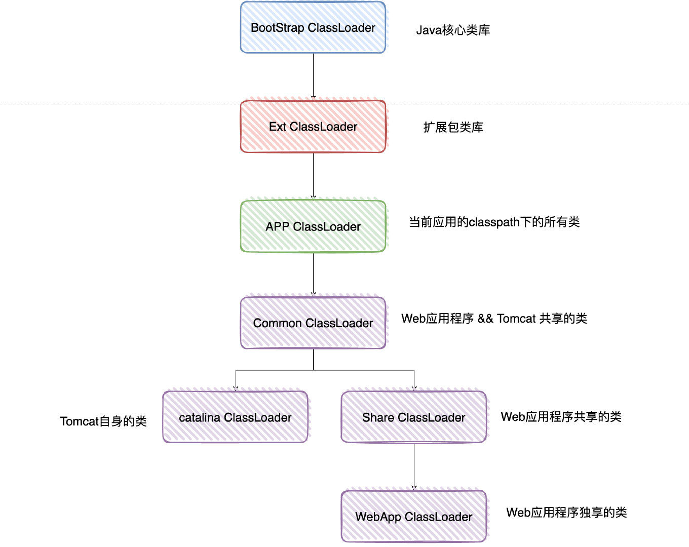

# Java类加载源码
## 源码
```java
public abstract class ClassLoader {

    private final ClassLoader parent;

    //双亲委派加载源码
    protected Class<?> loadClass(String name, boolean resolve)
            throws ClassNotFoundException
        {
            synchronized (getClassLoadingLock(name)) {
                //First, check if the class has already been loaded
                //首先，检查类是否已经加载
                Class<?> c = findLoadedClass(name);
                if (c == null) {
                    try {
                        if (parent != null) {
                            //如果不为null 说明是非BootstrapClassLoader  递归走双亲委派
                            c = parent.loadClass(name, false);
                        } else {
                            //如果父加载器为空，查找 Bootstrap 加载器是不是加载过了
                            c = findBootstrapClassOrNull(name);
                        }
                    } catch (ClassNotFoundException e) {
                        // ClassNotFoundException thrown if class not found
                        // from the non-null parent class loader
                    }

                    if (c == null) {
                        // If still not found, then invoke findClass in order
                        // to find the class.
                        //如果没找到自己加载
                        long t1 = System.nanoTime();
                        c = findClass(name);
                    }
                }
                return c;
            }
        }

    //自己加载
    protected Class<?> findClass(String name) throws ClassNotFoundException {
        throw new ClassNotFoundException(name);
    }
}
```
## 描述
```text
findClass方法是找到自己负责的区域的.class文件，并且调用JVM提供的方法将class装载进内存，并且得到Class对象
loadClass方法是public，即对外提供服务的接口。首先检查这个类是不是已经被加载过了，如果加载过了直接返回，否则交给父加载器去加载。请你注意，这是一个递归调用，也就是说子加载器持有父加载器的引用，当一个类加载器需要加载一个 Java 类时，会先委托父加载器去加载，然后父加载器在自己的加载路径中搜索 Java 类，当父加载器在自己的加载范围内找不到时，才会交还给子加载器加载，这就是双亲委托机制的实现。
```


# Tomcat类加载源码
Tomcat自定义的类加载器WebAppClassLoader 打破了双亲委托机制，它首先自己尝试去加载某个类，如果找不到再代理给父类加载器，其目的是优先加载 Web 应用自己定义的类。具体实现就是重写 ClassLoader 的两个方法：findClass 和 loadClass
## findClass方法
### 源码
```java
public Class<?> findClass(String name) throws ClassNotFoundException {
    ...

    Class<?> clazz = null;
    try {
            //1. 先在 Web 应用目录下查找类
            clazz = findClassInternal(name);
    }  catch (RuntimeException e) {
           throw e;
       }

    if (clazz == null) {
    try {
            //2. 如果在本地目录没有找到，交给父加载器去查找
            clazz = super.findClass(name);
    }  catch (RuntimeException e) {
           throw e;
       }

    //3. 如果父类也没找到，抛出 ClassNotFoundException
    if (clazz == null) {
        throw new ClassNotFoundException(name);
     }

    return clazz;
}
```
### 描述
```text
1.先在 Web 应用本地目录下查找要加载的类。
2.如果没有找到，交给父加载器去查找，它的父加载器就是上面提到的系统类加载器 AppClassLoader。
3.如何父加载器也没找到这个类，抛出 ClassNotFound 异常。
```
## loadClass方法
### 源码
```java
public Class<?> loadClass(String name, boolean resolve) throws ClassNotFoundException {

    synchronized (getClassLoadingLock(name)) {

        Class<?> clazz = null;

        //1. 先在本地 cache 查找该类是否已经加载过
        clazz = findLoadedClass0(name);
        if (clazz != null) {
            if (resolve)
                resolveClass(clazz);
            return clazz;
        }

        //2. 从系统类加载器的 cache 中查找是否加载过
        clazz = findLoadedClass(name);
        if (clazz != null) {
            if (resolve)
                resolveClass(clazz);
            return clazz;
        }

        // 3. 尝试用 ExtClassLoader 类加载器类加载，为什么？
        ClassLoader javaseLoader = getJavaseClassLoader();
        try {
            clazz = javaseLoader.loadClass(name);
            if (clazz != null) {
                if (resolve)
                    resolveClass(clazz);
                return clazz;
            }
        } catch (ClassNotFoundException e) {
            // Ignore
        }

        // 4. 尝试在本地目录搜索 class 并加载
        try {
            clazz = findClass(name);
            if (clazz != null) {
                if (resolve)
                    resolveClass(clazz);
                return clazz;
            }
        } catch (ClassNotFoundException e) {
            // Ignore
        }

        // 5. 尝试用系统类加载器 (也就是 AppClassLoader) 来加载
            try {
                clazz = Class.forName(name, false, parent);
                if (clazz != null) {
                    if (resolve)
                        resolveClass(clazz);
                    return clazz;
                }
            } catch (ClassNotFoundException e) {
                // Ignore
            }
       }

    //6. 上述过程都加载失败，抛出异常
    throw new ClassNotFoundException(name);
}
```
### 描述
```text
1.先在本地 Cache 查找该类是否已经加载过，也就是说 Tomcat 的类加载器是否已经加载过这个类。
2.如果 Tomcat 类加载器没有加载过这个类，再看看系统类加载器是否加载过。
3.如果都没有，就让ExtClassLoader去加载，这一步比较关键，目的防止 Web 应用自己的类覆盖 JRE 的核心类。因为 Tomcat 需要打破双亲委托机制，假如 Web 应用里自定义了一个叫 Object 的类，如果先加载这个 Object 类，就会覆盖 JRE 里面的那个 Object 类，这就是为什么 Tomcat 的类加载器会优先尝试用 ExtClassLoader 去加载，因为 ExtClassLoader 会委托给 BootstrapClassLoader 去加载，BootstrapClassLoader 发现自己已经加载了 Object 类，直接返回给 Tomcat 的类加载器，这样 Tomcat 的类加载器就不会去加载 Web 应用下的 Object 类了，也就避免了覆盖 JRE 核心类的问题。
4.如果 ExtClassLoader 加载器加载失败，也就是说 JRE 核心类中没有这类，那么就在本地 Web 应用目录下查找并加载。
5.如果本地目录下没有这个类，说明不是 Web 应用自己定义的类，那么由系统类加载器去加载。这里请你注意，Web 应用是通过Class.forName调用交给系统类加载器的，因为Class.forName的默认加载器就是系统类加载器。
6.如果上述加载过程全部失败，抛出 ClassNotFound 异常。
```

# 总结
```text
打破原因：主要原因是tomcat的web目录下可能会有多个目录包，如果直接加载AppClassLoader会导致多个项目中相同名称不同实现类覆盖
所以加载顺序：本地目录缓存->ExtClassLoader->BootstrapClassLoader->本项目录查找加载->AppClassLoader
```
## Tomcat是如何打破双亲委派机制的呢？

Tomcat是先去本地目录加载，为了避免本地目录覆盖掉JRE的核心类，如java.lang包等，先尝试用ExtClassLoader加载，这样即能打破双亲委派机制，有避免了覆盖掉核心类。

## 为什么不是尝试用AppClassLoader加载呢？

如果是尝试用AppClassLoader，这样不又变会双亲委派机制了嘛。

## 类加载结构图


## 参考链接
[https://blog.csdn.net/Miiiiiiiiiii/article/details/119324305](https://blog.csdn.net/Miiiiiiiiiii/article/details/119324305)
[https://www.zhihu.com/question/466696410](https://www.zhihu.com/question/466696410)
